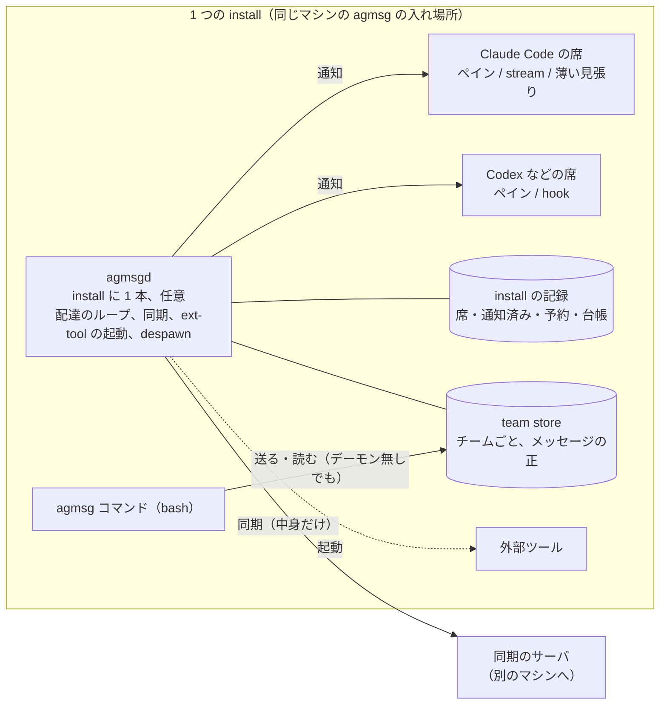
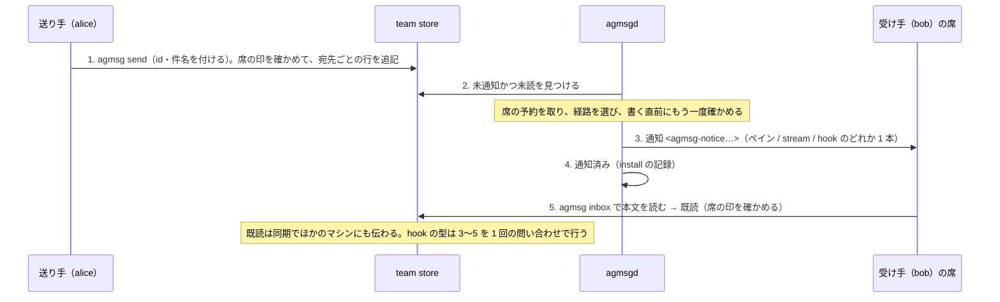
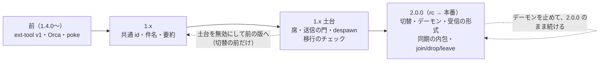

# agmsgd — アーキテクチャ設計

[RFC](agmsgd-rfc.ja.md) で承認した方向を、各部分がどう振る舞うかまで詰めた設計書です。今こうなっている、だけを書いています。それぞれの選択の理由は、discussion と、このあと書く ADR に残します。実装はまだ始めていません。次は技術設計（ソースの置き場所、ビルドと配布の方法、主要な部品）です。

状態: 2026-09-28。[English](agmsgd-architecture.md)

## 1. 概要

agmsg は、同じチームのエージェント（Claude Code、Codex ほか）がメッセージを送り合う仕組みです。agmsgd は、その install に 1 本だけ常駐するデーモンで、idle の席にも通知を届け、同期と外部ツール（ext-tool）の実行と despawn の受け渡しを受け持ちます。あわせて、メッセージに共通の id・件名・要約を載せ、ひとつの identity を同時に使える席を install の中で 1 つに守り、保存形を「宛先ごとの行」に切り替えます。

デーモンは任意で、入れなくても今の使い方（bash と sqlite だけ）は続きます。利用者とエージェントが打つのは `agmsg` コマンドだけです。

## 2. 全体の構成

デーモンが無いときは、Claude Code は薄い見張り、Codex は hook で受け取ります。

保存先は 2 つです。

- **team store**（チームごと）は、メッセージと既読の正です。同期でほかのマシンと中身を揃えます。
- **install の記録**（install に 1 つ、`run/install.db`）は、そのマシンの席・通知済み・送信中の予約・外部ツールの台帳・止まりの記録を持ちます。同期しません。

送る・読む・履歴・検索は、`agmsg` コマンド（bash と sqlite）が保存先を直接読み書きします。デーモンを通りません。デーモンは、配達（通知）、同期、外部ツールの起動、despawn の受け渡しを受け持ちます。セッションとは install の中の socket で話します。

## 3. 部品ごと

### 3.1 メッセージの形

- 送る側が、作るときに共通の id（uuid7）を振ります。同じメッセージが別のサーバ経由で届いても 1 通のままです。サーバを移しても id は変わりません。
- 件名（200 文字まで）と要約（1000 文字まで）を、送る人が任意で付けます。上限は後から広げません。超えたら送る側で断ります。件名が無いメッセージは、通知の行で本文の 1 行目を代わりに使います。要約は通知には載せず、同期と検索のためのものです。
- 作ったときの値（送り主、宛先、id、件名、要約）は、後から書き換えません。名前の変更は、読むときの表示にだけ効きます。
- 古い版（1.3.1 以上）は、知らない項目を読み飛ばして受け取れます。

### 3.2 保存形

- team store の正は events（追記だけの記録）です。メッセージは宛先ごとに 1 行で持ち、読むときに共通の id で 1 件にまとめます。受信箱は宛先ごと、履歴はメッセージごとに数えます。
- タグ宛て（購読しているメンバー全員へ）は、送るときに宛先を確定して、宛先ごとの行にします。購読の追加と削除も記録として流し、順に畳みます。
- 既読は同期して、どのマシンでも同じになります。通知済み（noticed）はそのマシンだけで、install の記録に持ちます。
- 検索は文字列の一致で探します（索引は作りません）。履歴と検索は、本文を見せても既読を変えません。
- 保存方式は sqlite だけです。

### 3.3 席の仕組み（identity とサブ）

- identity は、チームの中の名前と、変わらない id（member_id）の組です。名前は予約制で、leave しても解放しません。
- ひとつの install の中で、同じ identity をサブできる席は 1 つです。サブした席の記録（claims）は install の記録にあり、土台を有効にした後は、これが唯一の正です。席を取るたびに世代（gen）と印（token）が変わります。
- 送信と既読は、今の席の印と一致するときだけ受け付けます。確かめるのは team store の中の仕掛け（trigger）で、印を知らない古いコードの送信は断られ、古いコードの既読は黙って捨てられます（未読は残り、新しい見張りが届けます）。
- 席の交代（別のセッションへ移る、返す）は 3 段で進み、途中で止まっても、次に触ったコマンドやデーモンが続きを進めます。
- 送れないときの言い方は 4 種です: 交代中（少し待って再試行）/ 別のセッションへ移った / 回復待ち / 古いプロセス（「agmsg was updated while this process was running…」）。
- identity を持たないセッションは、受け取りも送りもできません。
- 別の install や別のマシンで同じ identity をサブしても、防ぎません（診断に出すだけ）。

### 3.4 配達（経路の選び方と通知タグ）

- 1 つの登録に経路は 1 本です。ペインが確かに分かればペインへ書きます。確かに無ければ型の経路（Claude Code は stream、Codex は hook）を使います。判定できなければ、どこにも書かずに止まり、状態を見る手段に理由を出します（下位の経路へ落ちて別の席に書く事故を避けるため）。
- 配るのは「まだ通知していない、未読のもの」です（hook は「未読」）。通知しただけでは既読になりません。既読になるのは、`inbox` や hook が本文を渡したときだけです。
- 通知は at-least-once です。同じ通知が 2 回出ることがあります。既読には影響しません。
- 席ごとに、送っている途中の予約は 1 本です。書く直前にもう一度確かめます。外部の子プロセスが残っている間は、次を送りません。
- ペインの通知はタグの形で打ちます: `<agmsg-notice from="alice" unread="3">件名</agmsg-notice>`。1 行 200 文字まで。件名の中の `<` `>` `"` `&` は無害化するので、タグの外へ抜け出せません。ただし、誰でもこの形を打てるので、送り主の証明にはなりません（skill の文にもそう書きます）。
- ペインに書く文字の制御文字は、見える文字に置き換えます（ESC は `␛`、改行は `↵`、TAB は空白など）。端末の制御やキーの操作として働きません。`poke` も同じ規則で、1.4.2 以降の版で先に出します。
- terminal driver（tmux、herdr、Orca など）には新しい動詞を足しません。文字は文字のまま送ることを driver との約束にします。

### 3.5 デーモン本体（agmsgd と agmsg コマンド）

- デーモンのプロセスの名前は `agmsgd`、install ごとに 1 本です。持ち主の記録は install の記録にあり、起動するたびに世代が上がります。2 本目は起動しようとしても、今の持ち主が生きていれば、理由を出して終わります。
- 利用者とエージェントが打つのは `agmsg` だけです: `agmsg daemon start` / `stop` / `status`。`agmsgd` は Node の入口の小さな実行ファイルで、Node 22.13.0 以上が要るのはここだけです。`agmsg` は bash と sqlite で動きます。
- install の中身が更新されると、デーモンは自分で身を引きます。新しい版は古い版を signal で止めません。signal は、安全に送れる環境（Linux の pidfd）だけで送ります。
- team store は、それを引き取った install にだけ属します。別の install の保存先を写してきたものは、明示の操作（`agmsg daemon adopt-store`）で、新しく取った一貫した写しだけを引き取ります。
- デーモンを使う意図（使う / 使わない）は記録として持ち、「意図して使っていない」と「起動に失敗した」を見分けます。

### 3.6 セッションとデーモンの通信

- セッションは、install の中の socket（デーモンの世代ごとに別の名前）でデーモンに繋ぎ、自分の席を登録します。デーモンは、登録された席の印を確かめてから通知を送ります。
- デーモンはメッセージを代わりに送りません。送るのはいつも各セッションの `agmsg` です。
- stream（Claude Code）: デーモンが通知を送り、client が画面に書き終えたら「届けた」を返します。接続が切れても予約は残り、同じ client が再接続して結果を返せます。
- hook（Codex など）: ターンごとに hook がデーモンに問い合わせ、未読の本文を受け取って渡し、既読にします。1 回のターンの配達は 1 つの操作として扱い、途中で落ちても重複と取りこぼしを起こしません。
- ペインだけの席に、hook へは本文を返しません（デーモンがペインに書きます）。
- デーモンを止めると、Claude Code の stream の席は、次のセッション開始から薄い見張りに移ります。未読は消えません。

### 3.7 同期

- 同期するのはメッセージの中身だけです（既読を含む。通知済み・席・配達の記録はそのマシンだけ）。
- 1 つのチームの同期の持ち主は 1 つです。今の同期のプロセス（engine）からデーモンへ移すのは、明示の操作（`agmsg sync adopt`）だけです。移すときは、古い engine のプロセスが確かに終わったと分かるまで、デーモンは同期を始めません（2 本が同時に同期しないため）。戻すのは `agmsg sync handoff` です。
- 意図して同期を止める（off）ことができ、止めた記録は後から来た要求より優先します。
- 古い鍵で暗号化されたまま取り込めていない行は、その鍵が失われると戻りません（件数を出します）。

### 3.8 外部ツール（ext-tool）

- 外部のプログラムを、チームのメンバーとして呼べます。アダプタとの約束（標準入力の JSON、標準出力が返事、終了コード、時間の上限）は変えません。
- 1 通のメッセージに台帳の 1 行です。起動の前に「起動する」を記録してから子を作るので、台帳に行が無いメッセージは、確かに一度も起動されていません。結果を全部保全してから返事をします。
- 結果が分からないもの（起動した後に落ちた）は、二度と起動しません。同じメンバー宛ては 1 通ずつ、到着の順に起動します。
- 実行の持ち主は、2.0.0 で最初にデーモンが起動したときに、自動でデーモンへ移ります。保存形を切り替える前に届いていたものは、実行されたか分からないので改めて実行しません（件数を出します）。切り替えた後に届いて、この install でまだ実行されていないものは、デーモンへ移った後に実行します（届いてから時間が経っていても）。

### 3.9 despawn

- 頼んだ側が、相手の席が返ったのを確かめてから、そのペインを閉じます。
- 頼むと、片付けの要求（メッセージの種類 `ctrl.despawn`）を送ります。メッセージの本文をコマンドとして実行することはしません。要求は、この install で受け付けた記録があるものだけを実行します（同期や写しで来たものは実行しません）。
- 受け取るのは相手の席の中の受け手です: デーモンがあれば stream の client や hook、デーモンが無ければ薄い見張りや hook。受け手は自分の席と要求の宛先を照らしてから、席を返します。受け手の無い席（hook の無い、ペインだけの席）は `--force` だけです。
- 閉じる前に、ターミナルのサーバーが頼んだときと同じで、そのペインの前面に席を返したセッションが居ることを確かめます。確かめられなければ閉じません（席は返ります）。閉じる操作は 1 回だけで、結果が分からなければ閉じ直しません。表示は「席を返した」と「ペインを閉じた / 閉じていない」を分けます。
- 要求には期限があり、期限を過ぎたものは実行しません。デーモンは force をしません。
- 受け入れた穴: 確かめてから閉じるまでの間に、閉じる先の中身が別のセッションに入れ替わると、そのセッションを閉じます。同じペインで後継のセッションが始まる形を含み、tmux でも起きます。今のコードにも同じ窓があります（[#1385](https://github.com/fujibee/agmsg/issues/1385)）。

### 3.10 状態を見る手段

- `agmsg doctor`（今の `doctor.sh`）に、見えるべき 8 つを節として足します: 席と経路 / 直近の配達 / 同期 / 止まっている理由 / despawn の要求 / 外部ツールの結果 / 版 / セッションごとの受信の状態。`agmsg daemon status` は、そのうちデーモンの分だけを出します。
- 読むだけです。記録を書き換えず、回復も起こしません。デーモンに聞くのは、今つながっている接続のことだけです。
- 黙って止まらないための書き方: 読めなかったものを 0 件とは言わない / 止まりの記録が無くても「止まっていない」ではなく「記録された止まりは無い」と言う / 生きている・死んでいる・判定できないの 3 つで言う / 観測した時刻を付ける。
- デーモンに繋がらないときは最初の行でそう言い、各節は記録から読んだものだと示します。意図して使っていない構成は、故障として出しません。

## 4. 移行（切替）と、出す順番

### 考え方

- 互換性の無い変更は、2.0.0 の 1 回にまとめます: データの形の切替、受信の形式（デーモンの配達、通知済みと既読の分け方）、同期をデーモンに入れること、join / drop / leave の語。
- それ以外は、できる限り 1.x の間に入れて、問題の出る点を先に潰します。
- 2.0.0 は、デーモンの配達（idle の席への差し込み）とセットで出します。出す前に 2.0.0-rc を切って、実機で確かめます。
- 1.x の間に新しい表へ二重に書いておくこと（影書き）はしません。古い版や同期で来た行は影を書かないので、切替では結局今の表から写し直すことになるためです。

### 移行のチェック（1.x の間に）

- `agmsg migrate --check` は、本物の保存先の一貫した写しを取り、その写しの上で、2.0.0 と同じ切替のコードを最後まで走らせます。本物は変えません。何度でも回せます。
- 報告するもの: メッセージの消失と重複、中身の一致、既読の件数、id の畳みの重なり、取り込めない行、新しい形の制約に合わない行、所要時間。
- id の畳み（2.0.0 では identity を「チームと名前」で 1 つにまとめます）:
  - **切替を止める衝突:** 同じ名前に違う id（別のマシンで違う id が付いた場合を含む）、同じ名前に生きた持ち主が 2 つ（判定できない場合を含む）。利用者が選ぶまで切替に進みません。チェックの結果は「選択待ち」になり、合格とは言いません。
  - **注意として見せるだけのもの:** 同じ名前で種類が違う（Claude Code の `bob` と Codex の `bob`）、同じ名前・同じ種類でプロジェクトが違う。1 つの identity に登録が複数あるのは衝突ではなく、両方残ります。2.0.0 でも、同時にサブできる席は 1 つ（今と同じ）です。
- チェックは、自分で作った置き場の中の写しだけに書き、同期・通知・ペインを閉じる操作・外部ツールは走らせません。1.x の版では、普通の操作から切替のコードに届く道はありません。
- 言えるのは「同じ入力・同じ版・同じ選択のときだけ、2.0.0 の切替の結果はチェックと同じ」までです。本物はその後も変わるので、本番の切替の直前にもう一度回します。
- join のときの警告: 同じ名前が別の種類や別の場所にすでにあると、「2.0.0 では同じ identity として扱われ、同時にサブできる席は 1 つです」と知らせます。join は断りません。

### 新しい保存形への切替（2.0.0）

- 同じファイルのまま切り替えます。切替の前に、一貫した写し（バックアップ）を取り、場所を示します。
- 切替を止める衝突（同じ名前に違う id、同じ名前に生きた持ち主が 2 つ）が残っていれば、利用者が選ぶまで切替に進みません。
- 書き手の世代の印を上げた時点が戻せない点です。以後、切替の前の版のコードは送れず、取り込めず、同期もできません。古い同期の engine は版の門で断られます。
- 切替の前の未読は、「移行前の未読 N 件」の 1 行で知らせます。
- 写しから古い版の store を戻したことは、install が覚えている最低の世代で見分けます。
- デーモンは、切替が済んだ install でだけ起動し、受け持つのは切替が済んだ保存先だけです。

### 出す順番

戻せないのは 2.0.0 の切替だけです。

| 回 | 何が入る | 何が止められる（止め方） | 何が戻せない |
|---|---|---|---|
| 前（1.4.0〜） | ext-tool v1、Orca の terminal driver、1.4.2 以降で `poke` とペインの文字の置き換え | `poke` は前の版に戻せる | 無し |
| 1.x | 共通 id・件名・要約、取り込んだ行の読み直しの広げ、通知の行の形 | 新しい項目を送らないようにする（受け取りは続く） | 無し（項目を足すだけ、読み直しは何度やっても同じ） |
| 1.x 土台 | install の記録、席の記録と有効化、送信と既読の門、拒否の言い方、交代の回復、despawn の要求と受け手、`agmsg doctor` の土台の節、無効化の操作、移行のチェック、join のときの警告。検索（文字列の一致）はここに前に出してもよい | `agmsg deactivate` で有効化の前の状態に戻し、前の版へ戻せる（切替の前だけ。データは消えない。無効の間は土台の保護が効かない）。移行のチェックは写しの上だけで動く | 無し |
| 2.0.0（rc で確かめてから） | データの形の切替（宛先ごとの行、タグ宛てと購読、切替の操作）、受信の形式（agmsgd の配達、通知済みの記録と「表示した分だけ既読」、hook の既読）、同期のデーモンへの内包、join / drop / leave の語、外部ツールの配達、despawn のデーモンの配り方、`agmsg doctor` のデーモンの節 | 切替の前なら切り替えない。切替の後は、デーモンを止めて、同じ 2.0.0 の中でデーモン無しの受信で続けられる（送る・読む・検索、薄い見張りと hook、同期は `handoff` で今の engine へ。外部ツールはデーモンが戻るまで保存して待つ） | データの形の切替（バックアップから戻す以外に無い）。同じ名前の登録を 1 つに畳むこと（利用者が選ぶ）。実行した外部ツール、閉じたペインなどの副作用 |

検索は今の表のまま動くので、1.x に前に出してもよく、2.0.0 のままでもよい（どちらでも約束は同じ）。実装に入るときに決めます。

2.0.0-rc で確かめること: 本物の写しでの切替（移行のチェックと同じ結果）、本物の席でのデーモンの配達、同期の adopt と handoff、外部ツールの移行、デーモンを止めて続けること、despawn。

## 5. 守る性質とその限定

| 守る性質 | 限定（守らないこと、条件） |
|---|---|
| 出す順番のどの時点でも、メッセージは消えない | 古い鍵を失うと、それで暗号化されたまま取り込めていない行は戻らない。バックアップから戻すと、その後の更新は失われる |
| 古い版（1.3.1 以上）が残っていても止まらない | 古い版は新しいもの（タグ宛てなど）が見えないだけ。切替の後の古い版は、その install では送れない |
| install の中で、同じ identity をサブできる席は 1 つ | 別の install・別のマシンとの重なりは防がない（診断だけ） |
| 送信と既読は、今の席の印と一致するときだけ受け付ける | 土台を無効にしている間は効かない |
| 同じ席に 2 つの経路を同時に選ばない | 落ちた後の重複は at-least-once の内 |
| 通知は届く（at-least-once） | 同じ通知が 2 回出ることがある。ペインに書いたことは、モデルに届いた証拠ではない。対応する型・経路の範囲だけ（Codex のデスクトップアプリは v1 の外） |
| 通知しただけでは既読にならない | — |
| ペインに書く文字が、端末の制御やキーの操作として働かない | 守るのは形の上だけ。件名がタグの中で指示を名乗ることや、モデルがそれに従うことは防げない。タグは送り主の証明にならない |
| 外部ツールは同じメッセージで 2 回起動しない | 上げた直後、古い版に由来する追跡できない実行が残る間は、同じメンバー宛ての別の通と並行しうる（期間の上限は保証しない）。切替の前に届いていたものは実行しない |
| despawn は古い要求で新しい席を消さない、デーモンは force しない | 確かめてから閉じるまでに閉じる先が入れ替わる窓（#1385）。期限は観測した時点で判定し、その後に期限を過ぎて実行されうる |
| 黙って止まらない | 準備の記録を書く前に突然死んだものは観測できない |
| 戻せない切替は 1 回だけで、事前に知らせる | 実行済みの副作用は取り消せない |
| デーモンを入れなくても今の使い方は続く（2.0.0 の中でデーモンを止めても同じ） | デーモン無しでは、ペインへの通知、同期の内包、外部ツールの自動起動は無い。受け手の無い席の despawn は `--force` だけ |

## 6. 未測のもの、実装の時に確かめるもの

### 未測のまま残るもの

- herdr のサーバーの実体の印（再起動を見分ける値）を driver から取れるか。取れない間は、herdr の席では despawn でペインを閉じない（席は返る）。サーバーの再起動をまたいだペイン番号の使い回し。
- tmux でペインの前面のプロセスを driver から引ける範囲。
- 土台の無効化の後に戻せる前の版の範囲（lock の鍵と持ち主の印の規則が今と同じ版がどこからか）。
- Windows で、プロセスの生死とプロセスのグループを確かめられない箇所（「未対応」として出す）。

### 実装の時に確かめるもの

- 途中で落ちたときの振る舞いを、故障の注入で確かめる: 席の交代、有効化と無効化の各段、切替の各段、外部ツールの起動の各段、despawn の閉じる操作、lock を書く子の許可と消滅。
- `agmsg doctor` が 5 秒以内に終わること、どの関数も書き込まないこと。
- terminal driver が文字を文字のまま送ること（適合の試験。Orca の driver もこれを通してから使う）。
- 通知の文字の置き換えで、制御文字が残らないこと、日本語と絵文字が残ること、下流でバックスラッシュを解釈しないこと。
- 席の共存を変える変更は、本物の 2 席で動かした結果（役ごとのプロセス数など）を添える。

### 測って決まったもの

- Node 22.13.0 から、Node の SQLite をフラグ無しで使え、使う操作がそろう。全文検索（FTS5）は入っていない。
- 同期の engine は、測ったマシンではチームごとに 1 本まで、pidfile は実プロセスと食い違うことが多い（pidfile を正にしない根拠）。
- herdr は同じサーバーの間はペイン番号を使い回さず、ペインの前面のプロセスを引ける。

## 7. 用語

| 語 | 意味 |
|---|---|
| install | 同じマシンの agmsg の入れ場所 1 つ。デーモンも、席の排他も、install ごと |
| identity | チームの中の名前と、変わらない id（member_id）の組。名前は解放しない |
| サブ | セッションが identity を名乗って使い始めること（今の `actas`）。install の中で 1 つだけ |
| 席 | サブした状態。世代（gen）と印（token）を持ち、交代するたびに変わる |
| team store | チームごとの保存先。メッセージと既読の正。同期でマシン間の中身を揃える |
| install の記録 | install ごとの保存先（`run/install.db`）。席、通知済み、予約、台帳。同期しない |
| 通知済み（noticed） | このマシンで通知を出したという記録。既読とは別 |
| 切替 | 新しい保存形への切替（2.0.0）。戻せない点はここだけ |
| 移行のチェック | `agmsg migrate --check`。本物の写しの上で 2.0.0 と同じ切替を走らせて突き合わせる。1.x の間に何度でも回せる |
| rc | 2.0.0 を出す前に切る試しの版（`2.0.0-rc.N`）。実機で問題を確かめる |
| 土台 / 有効化 / 無効化 | 席の記録と送信の門を効かせる回。有効化で効き、無効化で前の状態に戻る |
| 経路 | 通知の届け方: ペイン、stream（Claude Code）、hook（Codex など） |
| 薄い見張り | デーモンが無いときの Claude Code の受け取り口（今の `watch.sh` の後継） |
| タグ宛て / 購読 | タグを購読しているメンバー全員に送ること。宛先は送るときに確定 |
| ext-tool | 外部のプログラムをメンバーにする仕組み。台帳は 1 通に 1 行 |
| at-least-once | 少なくとも 1 回届く。2 回出ることがある |
