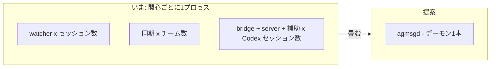
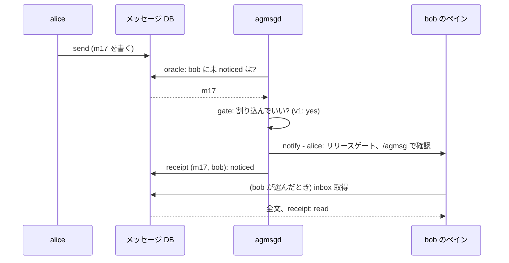

# RFC: agmsgd — 常駐配達デーモン

これは RFC ---- 設計への意見を求める文書であって、決定の記録ではない。決まったことは従来どおり ADR に落ちる。**変えるのがまだ安いうちに形を変えられるよう**、実装の前に公開する。

前提は terminal driver リリースが着地していること: join した全エージェントのペインに名前が付き、その名前に対して `peek`(切り替えずに画面を見る)と`poke`(ペインに1行打つ)が効く。このリリースが入っていれば、この note の前提は全部揃っている。

## これで何が良くなるか

大きな変更なので、利点を最初に置く。どれも今日は手に入らないもの:

1. **メッセージが消えなくなる。**エージェントが実際に取りに行くまで、何も既読にならない。いまは壊れた・残留した watcher が誰も見ていないメッセージを消費できる。この変更の後、その壊れ方は構造的に不可能になり、取られなかったメッセージは「届いたが未読」として見える形で残る。
2. **通知がエージェントのコンテキストを食わなくなる。**いまの monitor モードは全文をセッションに押し込む — エージェントが今それを必要としていようがいまいが、コンテキスト窓を消費する。変更後は1行の通知(送り主 + 件名)だけが届き、全文にコンテキストを使うタイミングはエージェント自身が決める。
3. **Codex が起動ラッパー無しで動く。**Codex へのリアルタイム配達にラッパー起動が不要になる — これまで出荷した Codex バグの最大の発生源であり、ラッパーが原理的に使えなかった Codex デスクトップアプリへの道も開く。
4. **プロセスの群れが1本になる。**忙しい実機で数えたら agmsg のバックグラウンドプロセスはおよそ15本あった(watcher、チームごとの同期、Codex の補助)。これが監督された1本のデーモンになる。配達がおかしいとき、見る場所がデーモン1つになる。
5. **ツールをまたいで1つの名前、グループ宛の1通。**エージェントは Claude Code で動いていても Codex で動いていても1つの identity を保ち、1通のメッセージがタグ(グループ)を宛先にでき、受信者ごとの状態が独立に追跡される(今日はどちらも不可能)。
6. **リモート操作のための土台。**`despawn` を安全に実行するのと同じ仕組みが、将来スマホからペインを peek することを可能にする — 場当たりのテキスト解釈ではなく、明示的な認可モデル付きで。

## なぜ今か

きっかけは実際に出たバグだ。ユーザーが実際に踏んだ問題のいくつかは、メッセージングではなくプロセスの群れの管理から来ていた: 残留 watcher が誰も持っていない役のメッセージを消費し続けた; Codex セッションが再起動まで黙って受信しなくなった; 配達設定の無いプロジェクトと意図して "off"にしたプロジェクトの区別が付かなかった。それぞれに個別の修正を当てたが、このクラスは何度でも戻ってくる。監督された常駐プロセス1本で、クラスごと消える。

## 変更の要約

**1つの常駐デーモン `agmsgd`** がメッセージストアを見張り、各エージェントに名前付きペイン経由で知らせる。あなたに見える変化:

- **monitor モード**: セッションごとの watcher プロセスが消える。セッションの中から見た配達は近い形だが、届くのは1行の通知になり、やっているのはデーモンになる。
- **Codex**: 起動ラッパーが不要になる(Codex の節で詳述)。
- **送信**: 変わらない。`send` はデーモンの有無に関係なくメッセージ DB に直接書く。デーモン無しで失うのは自動配達だけ。

agmsg を日常的に使っているなら — 特に monitor モード、複数マシンのチーム、Codex — いまのコメントは後のバグ報告より価値がある。

## 提案

### デーモンは1つ

`agmsgd` は単一の常駐プロセス(Node 22 以上)。仕事は:

- メッセージ DB を見張り、配達ループ(次節)を回す
- 他マシンとの同期をチームごとのループとして**デーモン内で**回す —プロセスは増えず、あるチームの認証切れが他チームの同期を止めない
- 制御メッセージ(`despawn` の裏にある種類)を、受信側の LLM にやらせる代わりに自分で実行する
- インストール時に launchd / systemd に登録でき、再起動しても生きる —推奨だが**任意**: 無くても自動配達以外は全部変わらず動く

### 配達ループを具体的に

09:00、bob が作業中に alice が bob へメッセージを送ったとする。デーモンは3ステップを回す。以降の文中で参照するので名前を付けている:

1. **oracle** — *「bob に、まだ知らされていないものはあるか?」*ストアへのただの読み取り: bob 宛で「noticed」の記録が無いメッセージは? → ある。いま届いた1通、仮に m17。oracle は何も変更しない — 仕事を見つけるだけ。bob が登録済みでプロセスが生きているかもここで確認し、いなければループはここで終わり、m17 はただ待つ。
2. **gate** — *「いま bob に割り込んでいいか?」*ツールごとの規則。**v1 の答えは常に yes** — Claude Code も Codex も。割り込みの実体は1行の打鍵で、bob が作業中なら CLI 自身の入力キューが行を持っていて turn の終わりに出す。gate が名前付きのステップとして在るのは、将来のツールが「X の間は駄目」のような規則を必要とするかもしれないからで — そしていまの Codex bridge が実質、900行の複雑な gate だからだ。poke はその gate を不要にする。**残すのは席で、複雑さではない。**
3. **notify** — bob のペインに1行打ち、(m17, bob) の「noticed」を記録する。打鍵に失敗したら(ペイン消滅、ターミナル死)何も記録せず、次の周回で再試行する。

ループに**入っていない**ものに注目してほしい: 読むこと。m17 を既読にするのは bob 自身の inbox 取得だけだ。いまは表示した watcher が同じ手で既読も打つ — 壊れた watcher が誰も見ていないメッセージを消費できたのは、まさにそのせいだ。

### メッセージに件名が付く — そして検索が強くなる

なぜ全文ではなく1行の通知か。**押し込まれたテキストは、使われたコンテキストだから**だ。作業中のエージェントに長文が3通押し込まれたら、どれが重要か判断する前に3通ぶんのトークンを払っている。1行通知はこれを逆転する: エージェントは1通につき1行を見て、何をいつ取るかを選ぶ。

通知の1行が意味を運べるように、メッセージに任意のフィールドを2つ足す:

- **subject** — 1行の件名。送り主が付ける: `send <team> <from> <to> --subject "リリースゲート" "<長い本文...>"`
- **summary** — 長い本文向けの数文の要約。これも送り主が付ける。

デーモンが受信者のペインに打つ行はこうなる:

    [agmsg] alice: リリースゲート (ほか未読2件) — /agmsg で確認

件名が無ければ本文の先頭行で代用する。古い版からのメッセージも、件名を付けない送り主も、そのまま動く。

「いま取りに行かない」という選択が成立するのは、後から見つけるのが安いときだけだ。だから検索をこの変更と同時に出す。モデルは Gmail で慣れているあれ — 演算子 + 語を、subject / summary / 本文にかける。例:

    search 'from:alice subject:release after:2026-08-20 "drift"'
    search 'team:agmsg to:#devs before:2026-09-01'

送り主・宛先(タグ含む)・期間・自由語、すべて組み合わせ可。subject と summary は、生の本文よりましな検索対象を与えるために存在する。

### 誰が通知するか: セッションごとに経路は1本

配達のたびに、デーモンは受信者に届ける方法を1つだけ選ぶ。基準はそのセッションが実際にどこで動いているか:

1. デーモンが操作できるペイン管理(tmux、herdr、agmsg デスクトップアプリ)の中で動いている? → **名前付きペインに poke**。あなたが手で打つのと同じように、通知の1行をそのエージェントの端末に打ち込む。エージェントの種類によらず同じ1本道。
2. ペイン管理が無い? → ツール自身が持つ受け口に落ちる: Claude Code は動作中のセッションが聞いているチャネルを持つ; Codex は hook のタイミングで受け取る(Codex の節を参照)。
3. 両方使える — たとえば tmux のペインを herdr が管理している? → **あなたが実際に見ている方**だけを使う。同じメッセージが2経路から二度届くことはない。

セッションの居場所は配達のたびに調べ直す。前に記録した環境変数は入れ子の構成では古くなって嘘をつくからだ。

### デーモンはどうやって各エージェントの居場所を知るか

デーモンは見つけられるセッションにしか通知できない。だから各セッションが自分をデーモンに登録する:「team X の *bob* は私です — session id はこれ、process id はこれ、このターミナルのこのペイン、このプロジェクト」。(pub/sub で言えばこの登録が subscribe 側。送る側に登録は一切無い。)登録は**ペインに名前を付けるのと同じステップ**で作られる:

- **Claude Code**: 登録はセッション開始時(SessionStart hook)。役割の claim(join / actas)で登録がその名前に向き、drop かセッション終了で消える。
- **Codex**: 起動時に発火する hook が無い(Codex の SessionStart は最初の user turn で発火する)ので、登録はエージェント自身が実行する join / actas コマンドが作り、Stop / PostToolUse hook の発火ごとに更新される。
- **古い登録は残れない**: 登録は必ず process id を持ち、デーモンは配達前に生存を確認し、死んだ登録は回収される。「残留 watcher が誰も持っていない役のメッセージを食べる」バグはこれで恒久的に退役する。
- **デーモンが動いていなければ?** 登録の呼び出しは静かに何もしない。ほかは今までどおり進む。

### 購読が「役を明示する手順」を置き換える

セッションがどこに居るかを登録すれば、それが誰かも同時に決まる。だから今日ある別ステップは要らなくなる。

いまセッションは2つのことをしている。`join` が名前をチームに置き、`actas <name>` が「このセッションはその名前だ」と宣言して、排他ロックを取り、受信を絞る。2つ目は明示で、再起動のたびに繰り返す必要があり、間違えやすい ---- そして**間違いが無言**だ。役を宣言しなかったセッションは、そのプロジェクトに登録された**あらゆる役宛て**を受け取る。名前の引数なしで起動した watcher も同じことをする。どちらも、見えていないはずのセッションがメッセージを既読にしているのを誰かが気づくまで、正常な構成と見分けが付かない。この失敗は複数の番号で報告されて直っている(#62、#300、#982)。そのたびに新しい形で再発したのは、根っこの取り決め ---- 「**誰であるかを、毎回、別に言わなければならない**」---- が残っていたからだ。

**agmsgd では、セッションは必ず identity を持った状態で始まる。**言われるのを待つのではなく、セッション開始時に解決する ---- `spawn` が渡した名前から、前回この役を持っていた記録から、あるいはそのプロジェクトで空いている identity がちょうど1つならそれから。人に届くのは本当に曖昧なときだけで、identity を持つことは排他なので、デーモンは**誰も持っていないものだけ**を出せる。プロジェクトで最初の identity を作ることも、集合が空だっただけの同じ解決であって、初回だけの特別な儀式ではない。

**購読とは、その identity が何を受け取るかだ。**そして永続する ---- 自分の名前と、購読したタグ。セッションより長く生きるので、明日起動したセッションは、その identity が既に聞いていたものをそのまま引き継ぐ。排他なのはセッションと identity の結びつきの側で、同時に1セッションだけ ---- それが今のロックそのもので、打つのではなく自動で取られるようになる。

`actas` は消えるというより、本来そうであるべきだった例外に戻る: セッションを意図的に**別の** identity へ切り替える操作。毎回思い出さなければならなかった方の顔は、無くなる。

**忘れても何も起きなくなる。**identity を持たないセッションは、プロジェクトの全員宛てを受け取るのではなく、**何も受け取らない**。危ない既定が反転する ---- #300 と #982 を生んだのは「指定しなければ全部受け取る」で、ここでの失敗は「静かな inbox」だ。すぐ気づくし、誰も巻き込まない。

### 分離すると何ができるようになるか

**グループ宛に1通。** `to:#devs` がそのタグを購読している全 identity に届き、受信者ごとに noticed / read を持つ。3人は読んだ、2人はまだ ---- それが見える。いま同じ連絡をするなら N 回送るしかなく、誰が拾ったかは追えない。

**タグは管理するものではなく、購読するもの。** タグは最初の identity が購読した時点で生まれ、最後の1つが抜けた時点で消える ---- 台帳を手入れする仕事も、使われていないタグを掃除する仕事も無く、「存在するが誰にも届かないタグ」ができる余地も無い。数えるのは生きたセッションではなく identity なので、`#devs` は朝になっても在る。`#all` だけが両方向の例外で、チームができた瞬間から存在し、全 identity が暗黙に購読していて、誰も解除できない。

**誰も購読していないタグに宛てるのはエラー**であって、0人への配達ではない。`#devs` のつもりで `#dev` と打ったとき、無に向かって成功するのではなく、はっきり失敗する。

**1セッションから複数チーム。** identity は1チームに1つで、セッションはチームをまたいで複数持てる。1席がチームごとに窓を開けなくても、複数のチームで働ける。

**再起動後に名乗り直すものが無い。** 購読は identity のものなので生き残り、結びつきはセッション開始時に解決される。忘れる余地のある儀式が残らない。

**`from` が初めて「守られるもの」になる。** 実測: いまの `send` は排他ロックを一切参照しない。つまり登録さえあれば誰の名前でも送れる。identity を保持していることが、送り主の名前に意味を持たせる最初の仕組みになる。

### 1つの名前で全ツール、1通で複数の受信者

直接目に見える変化が2つ。それぞれ1つのストレージ変更が支える:

**エージェントは (team, name)。それだけ。**いまストアは登録を (team, name, *ツール種別*) でキーしているので、Claude Code 上と Codex 上の「同じエージェント」が別の登録になる。ユーザーから報告された重複登録の混乱の根本原因であり、leave / despawn に所有権チェックを足せない理由でもある。変更後、`bob` は `bob` だ — 今日どのツールで動いていようと。そして「誰が bob を消してよいか」に、規則を取り付けられる単一の答えがようやくできる。

**グループ宛、受信者ごとの追跡付き。**メッセージはタグ — たとえば`#devs` — を宛先にでき、そのタグを持つ全メンバーが自分宛の通知と自分の noticed/read 状態を持つ。具体的には、配達の印がメッセージ行から降りて(メッセージ, 受信者) ごとの1行になる:

    いま:  messages: id | from | to | body | created_at | notified_at | read_at
    提案:  messages: id | from | to | subject | summary | body | created_at
           receipts: message_id | team | recipient | noticed_at | read_at

時系列を1本:

    09:00  alice が「リリースゲート」を #devs に送る → メッセージ m17。receipt はまだ無い
    09:00  デーモンが bob と carol に通知         → receipts (m17,bob) (m17,carol): noticed
    09:03  bob が inbox を取得                    → receipt (m17,bob): read
    ...    carol は取得しない                      → (m17,carol) は noticed のまま: 見える

1人宛は、同じ仕組みの受信者1人ケースにすぎない。

### 土台づくり: LLM が解釈しない制御チャネル

トラフィックの中には会話ではなく命令のものがある。今日の例は `despawn` (エージェントを畳む): メッセージとして届き、**受信側の LLM が読んで従うことが期待される** — つまり安全性がモデルのテキスト解釈に依存している。agmsgd では命令メッセージはデーモンが種類を見て機械的に実行し、LLM には一切届かない。

v1 で出す命令は意図的に1つだけ — despawn、terminal driver 経由(graceful な畳みが tmux 専用という今の非対称もこれで直る)。この節が在る理由はその先にある。**命令の種類を増やす前に、この実行基盤の形に意見が欲しい**:

- **リモート peek / poke** — 別マシンやスマホから「bob の画面を見せて」「carol のペインにこれを打って」が同期経由で届き、ローカルのデーモンが実行する
- **認可モデル** — 命令を増やす前に「誰がどの命令を誰に発行できるか」に明示的で点検可能な答えが要る
- pause / handoff のような候補は、その門の後ろにだけ続く

「デーモンが命令を実行する」は不安に聞こえ得るので、セキュリティの姿勢を平文で書いておく:

- **命令は型付きで、自由文ではない。**命令は kind + スキーマ付きの構造化引数だ。デーモンはメッセージ本文に書かれたものを実行することは決してなく、どこにもシェルは介在しない。
- **既定は全部拒否。**v1 が受け付ける命令は despawn だけで、条件も今日動いているのと同じ(同じチーム内から、同じマシン上で)。それ以外の種類はすべて拒否される。
- **リモートは既定 off。**他マシンとの同期越しに届いた命令は、受信側のマシンでそのチーム・その命令種別を明示的に有効化していない限り無視される — チームごと、種類ごと。
- **全部ログに残る。**受理も拒否も、誰が何を要求したかのローカルな記録を残す。履歴は監査できる。
- 許可リストのモデル(「この送り主はこの種類をこの宛先に発行できる」)は、2つ目の命令種別が存在する前に独立の ADR として出す — **その ADR こそ意見が欲しいものだ。**

### 配達モードは自動で選ばれる

join 時の4択(monitor / turn / both / off)は消える。デーモンがそのセッションの環境で使える最良のモードを選ぶ。明示設定は引き続き勝つ。副作用として、「設定ファイルが無い」と「意図して off」が同じ状態でなくなる。

### 他マシンとの同期はどうなるか

いま、チームを他マシンと同期するには**チームごとに1本の常駐プロセス**が要る。必要になったときに起動され、pidfile で追跡される。この形は watcher と同じ問題を抱えている: プロセスが監督の外にあり、その存在を示す記録が「2度目の起動が上書きできるファイル」1つしか無い。**この note を書いている最中に実機で見つけたもの**: あるチームにエンジンが**2本**動いていて、起動は8分違い、pidfile は後から起きた方しか指していなかった。先に起きた方は同期を続け、そのチームのログに書き続けていて、しかも `stop` も `restart` も status も届かない ---- 3つとも pidfile を見るからだ(#1103)。

agmsgd では、同期は**デーモン内のチームごとのループ**になる:

- **別プロセスが無い。**孤児になるものが無く、見失うものが無く、「動いているものの唯一の記録」としての pidfile も無い。動いているのはデーモンが動いていると言うものだけだ。
- **失敗はチーム単位のまま。**あるチームの認証切れやサーバー到達不能は、そのチームのループだけを止める ---- プロセス分離で狙っていた性質は、そのまま保つ。
- **聞く場所が1つ。**全チームのサイクル数・最後の成功・現在のエラーが、デーモンへの1回の status で返る。チームごとに pidfile とログを突き合わせる必要が無くなる。

**変わらないもの**も書いておく(逆に思われやすいので): **同期は決して通知しない。**その仕事はメッセージをこのマシンに持ってくることで、行を書いてそこで終わる。エージェントに知らせるかどうかは、このマシンの配達ループの判断で、ローカルに送られたメッセージと**同じ noticed の帳簿**を使う。同期は写す、デーモンが知らせる。ここを分けておくことが、「他マシンから届いた」と「隣で送られた」をエージェントから見て同一に振る舞わせている。

サブコマンドは動き続ける: チームの同期を開始・停止するのは引き続き頼めることで、宛先がプロセスの起動・kill ではなくデーモン内のループになるだけだ。

### Codex には具体的に何が起きるか

いま Codex へのリアルタイム配達は、補助プロセス(「bridge」)が届くようにラッパースクリプト経由で起動することを要求している。このラッパーが、これまで出荷した Codex 関連バグの最大の発生源で(残留する補助プロセス、respawn ループ、起動時の競合)、しかも自分で起動を管理する Codex デスクトップアプリでは原理的に使えない。

この提案では、Codex への配達は公式の仕組み2つだけになる: hook(turn の終わり、および turn 中の各 tool call 後)と、管理されたペインで動いているときは他のエージェントと同じ poke。**どちらも Codex の起動方法に触れない。**残る唯一の穴は、素のターミナル(tmux も herdr も無し)で idle している Codex セッション — hook は発火せず、poke するペインも無い。その場合に限り旧 bridge を opt-in の fallback として残す。それすらも、Codex 自身の shared app-server daemon(最近の版で追加)が「普通に起動したセッションに外から届く」ことを確認できたら引退させる見込みだ。

**Codex デスクトップアプリ**は独立した環境として扱う。sandbox の制約でアプリ内のエージェントはメッセージ DB に直接書けないため、アプリ内からの送信は小さな受け渡しを通る: エージェントがリクエストファイルを書き、デーモンがそれを DB に適用し、**デーモンの確認が返って初めて「送れた」と報告する** — 確認が無ければ、送れたふりをせずエラーとして失敗する。(いま同じ状況は無言で失敗する。そちらの方が悪い。)アプリについては未測の事実がいくつか残っており、判明し次第この note を更新する。

## 互換性と移行

意図は「**今日打っているコマンドの意味は何も変わらない**」で、見える差分はすべて摩擦の除去であること。具体的に:

| いまやっていること | 変更後 |
|---|---|
| `send` / `inbox` / `history` | 同じコマンド、同じ挙動(+ subject/summary オプションと検索) |
| join 時に配達モードの4択に答える | 4択は消える。自動判定、明示設定は勝つ |
| `ps` に watcher プロセスが見える | `agmsgd` 1本 |
| monitor のために Codex をラッパーで起動 | Codex を普通に起動 |
| `despawn` は宛先 LLM の協力頼み | デーモンが実行。同じコマンド、確実に |
| 配達の不調をプロセス探しでデバッグ | デーモンに聞く: status 1発で登録・直近の配達・同期状態が並ぶ |

何がどこで動くか:

| できること | デーモンあり | デーモンなし |
|---|---|---|
| send / inbox / history / 検索 | ○ | ○ |
| 自動配達(通知) | ○ | ×(手動確認か turn 終わりの hook) |
| 他マシンとの同期 | 常時・監督付き | 手動 pull は可 |
| despawn / 将来の制御命令 | ○ | × |
| 依存 | Node 22+ | bash + sqlite のみ |

移行の事実:

- チームストア・登録・設定はその場で移行する。規則は実装に付く。旧来の単一受信者カラムは機械的に receipts 表へ運ばれる。
- 素のメッセージングの bash + sqlite 依存線は意図して保つ: Node を動かせないマシンでも送受信はできる。
- Codex bridge は初日に消さない: 既定 off の opt-in になり、カバーされない1ケース(素のターミナルで idle の Codex)専用に残る。

## 聞きたいこと(コメントが一番効くところ)

どれもまだ安く変えられる決定だ。「うちは実際に X してる」の1行で足りる。

1. **配達モードの自動選択。**デーモンは環境(ペイン管理はあるか、どのツールか)を見てモードを選ぶ。あなたの構成で、その推測が外れる —自明な選択とは別のモードが欲しい — ケースはあるか?
2. **noticed は read ではない。**変更後、1行通知として表示されたメッセージは既読にならない。既読になるのは inbox 取得だけ。「watcher が表示した = 既読」を前提にしたスクリプトや習慣はあるか?
3. **(team, name) で identity は1つ。**「同じ」エージェント名を2つのツールで動かすと、2つの登録ではなく1つの identity になる。同名・別ツールを意図して分けて運用している人はいるか?
4. **検索。**実際に何を探したいか — 送り主、日付、語、チーム? どこまで遡る? Gmail 風の演算子(from: / after: / subject:)で足りるか?
5. **制御命令。**despawn の先、自分のマシンでリモート peek / poke を有効にするとしたら何が条件か — チームごとの opt-in、送り主の許可リスト、監査ログ、それ以外?
6. **デーモン無しの fallback。**デーモン無しでも使える形(手動の inbox 確認、自動配達なし)を保つ計画だ。実際にその形で運用するか、それとも簡素化してデーモン必須にすべきか?
