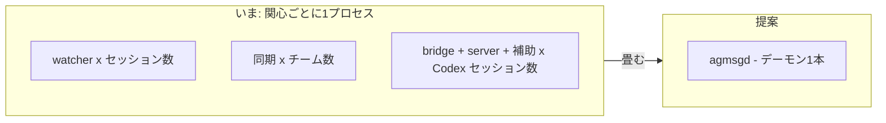
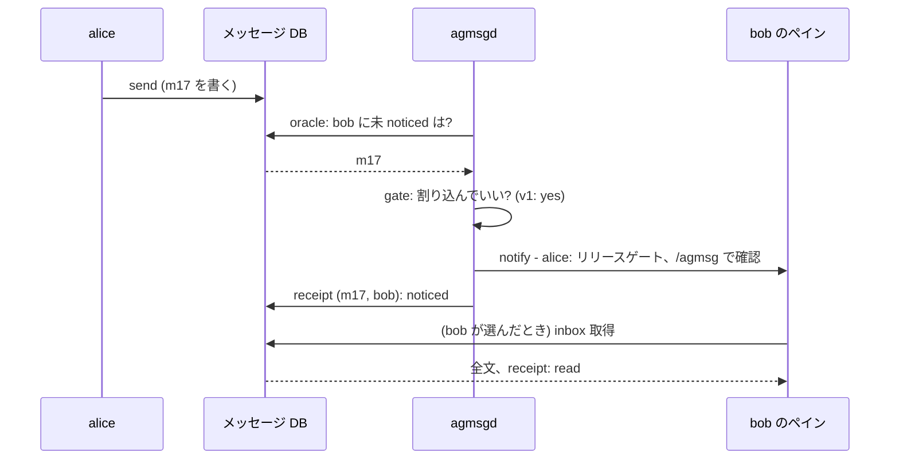

# RFC: agmsgd — 常駐配達デーモン

これは RFC ---- 設計への意見を求める文書であって、決定の記録ではない。決まったことは従来どおり ADR に落ちる。**変えるのがまだ安いうちに形を変えられるよう**、実装の前に公開する。

> **現在の状態(2026-09-28)。** ここに書いた方向は承認され、この note はそれに合わせてある。最初の版から変わった点は[最初の版からの変更](#最初の版からの変更)にまとめた。アーキテクチャ設計(各部分がどう動くか)は済み、この note の隣に [agmsgd-architecture.ja.md](agmsgd-architecture.ja.md) として置いた。次は技術設計(ソースの置き場所、ビルドと配布の方法)で、実装はその後になる。どのリリースも止められるものにし、一気には作らない。discussion で問いに答えてくれた方々に感謝する ---- 答えは以下に反映してある。

前提は 1.3.0 で出荷された terminal driver。そのリリースが下に敷いたもの ---- そしてこの note が乗っているもの ---- は**ターミナル層の identity** だ: ペインは自分がどのエージェントのものかを知っていて、それは tmux でも herdr でも同じ形で成り立ち、その結びつきは記録され、検査でき、直せる。`peek` / `poke` / `arrange` は同じ命名の上に建った便利機能であって、配達デーモンが必要としているものではない。デーモンが要るのは**宛先を場所に解決すること**で、それを可能にしたのが 1.3.0 だ。

## これで何が良くなるか

大きな変更なので、利点を最初に置く。どれも今日は手に入らないもの:

1. **メッセージが消えなくなる。**エージェントが実際に取りに行くまで、何も既読にならない。いまは壊れた・残留した watcher が誰も見ていないメッセージを消費できる。この変更の後、その壊れ方は構造的に不可能になり、取られなかったメッセージは「届いたが未読」として見える形で残る。
2. **通知がエージェントのコンテキストを食わなくなる。**いまの monitor モードは全文をセッションに押し込む — エージェントが今それを必要としていようがいまいが、コンテキスト窓を消費する。変更後は1行の通知(送り主 + 件名)だけが届き、全文にコンテキストを使うタイミングはエージェント自身が決める。
3. **Codex が起動ラッパー無しで動く。**Codex へのリアルタイム配達にラッパー起動が不要になる — これまで出荷した Codex バグの最大の発生源だ。(Codex デスクトップアプリは最初の版の対象外。Codex の節を参照。)
4. **プロセスの群れが1本になる。**忙しい実機で数えたら agmsg のバックグラウンドプロセスはおよそ15本あった(watcher、チームごとの同期、Codex の補助)。これが監督された1本のデーモンになる。配達がおかしいとき、見る場所がデーモン1つになる。
5. **ツールをまたいで1つの名前、グループ宛の1通。**エージェントは Claude Code で動いていても Codex で動いていても1つの identity を保ち、1通のメッセージがタグ(グループ)を宛先にでき、受信者ごとの状態が独立に追跡される(今日はどちらも不可能)。
6. **リモート操作のための土台。**`despawn` を安全に実行するのと同じ仕組みが、将来スマホからペインを peek することを可能にする — 場当たりのテキスト解釈ではなく、明示的な認可モデル付きで。

```mermaid
flowchart LR
  subgraph today["いま: 関心ごとに1プロセス"]
    w1[watcher x セッション数]
    s1[同期 x チーム数]
    c1[bridge + server + 補助 x Codex セッション数]
  end
  subgraph after["提案"]
    d[agmsgd - デーモン1本]
  end
  today -->|畳む| after
```

## なぜ今か

きっかけは実際に出たバグだ。ユーザーが実際に踏んだ問題のいくつかは、メッセージングではなくプロセスの群れの管理から来ていた: 残留 watcher が誰も持っていない役のメッセージを消費し続けた; Codex セッションが再起動まで黙って受信しなくなった; 配達設定の無いプロジェクトと意図して "off" にしたプロジェクトの区別が付かなかった。それぞれに個別の修正を当てたが、このクラスは何度でも戻ってくる。監督された常駐プロセス1本で、クラスごと消える。

## 変更の要約

**1つの常駐デーモン `agmsgd`** がメッセージストアを見張り、各エージェントに名前付きペイン経由で知らせる。あなたに見える変化:

- **monitor モード**: セッションごとの watcher プロセスが消える。セッションの中から見た配達は近い形だが、届くのは1行の通知になり、やっているのはデーモンになる。
- **Codex**: 起動ラッパーが不要になる(Codex の節で詳述)。
- **送信**: 変わらない。`send` はデーモンの有無に関係なくメッセージ DB に直接書く。デーモン無しで失うのは自動配達だけ。

この順で出す:

1. **1.3.1** — まだ知らないメッセージの項目を読み飛ばせるようにする(出荷済み)。
2. **古い版が脇によけたものの読み直し** — 上げたあと、以前は理解できなかった保存済みの原文を読み直す(出荷済み)。
3. **新しいメッセージすべてに、共通の id・件名・要約を付ける**(1.x)。
4. **土台**(1.x) — どのセッションがどの名前を持っているかの記録、送信時の検査、何度でも回せる移行のチェック(`agmsg migrate --check`)、そして同じ名前がすでに別の所にあるときの join 時の警告。
5. **2.0.0** — 互換性の無い変更をまとめて入れる: 新しい保存形(受信者ごとの受領、タグ、そしてこの設計全体でただ1つの戻せない段階。[互換性と移行](#互換性と移行)を参照)、デーモンによる配達、同期のデーモンへの内包、join / drop / leave の呼び方。先に試しの版(2.0.0-rc)を切り、実機で確かめる。

1〜4 はそれぞれ単体で使える。新しい保存形とデーモンは意図して一緒に出す: 保存形の切り替えだけを出すと、互換性を壊すだけで便利さが無いからだ。

3 より前に、これとは別のものが2つ入った: 外部ツールの呼び出し(1.4.0 で出荷済み。2 もこの版に入っている)と、Orca 用の terminal driver(1.5.0 で出荷済み)。

agmsg を日常的に使っているなら — 特に monitor モード、複数マシンのチーム、Codex — いまのコメントは後のバグ報告より価値がある。

## 提案

### デーモンは1つ

`agmsgd` は単一の常駐プロセス(Node 22.13 以上)で、agmsg の install ごとに1本。仕事は:

- メッセージ DB を見張り、配達ループ(次節)を回す
- 他マシンとの同期をチームごとのループとして**デーモン内で**回す — プロセスは増えず、あるチームの認証切れが他チームの同期を止めない
- 制御メッセージ(`despawn` の裏にある種類)を、受信側の LLM にやらせる代わりに自分で実行する
- インストール時に launchd / systemd に登録でき、再起動しても生きる — 推奨だが**任意**: 無くても自動配達以外は全部変わらず動く

`agmsgd` はプロセスの名前だ ---- `ps` に見え、サービスの仕組みが起動するもの。手で打つコマンドではない。打つのは `agmsg` コマンド1つで(2.0.0 より前に入る)、デーモンの操作もそこから行う(`agmsg daemon start` / `stop` / `status`)。`agmsg` 自体はデーモン無しでも動く。

### 配達ループを具体的に

09:00、bob が作業中に alice が bob へメッセージを送ったとする。デーモンは3ステップを回す。以降の文中で参照するので名前を付けている:

1. **oracle** — *「bob に、まだ知らされていないものはあるか?」*ストアへのただの読み取り: bob 宛で「noticed」の記録が無いメッセージは? → ある。いま届いた1通、仮に m17。oracle は何も変更しない — 仕事を見つけるだけ。bob が登録済みでプロセスが生きているかもここで確認し、いなければループはここで終わり、m17 はただ待つ。
2. **gate** — *「いま bob に割り込んでいいか?」*ツールごとの規則。**v1 の答えは常に yes** — Claude Code も Codex も。割り込みの実体は1行の打鍵で、CLI がそれを保持するからだ。Claude Code で測った結果: 作業中に打たれた1行は消えず、他の入力と混ざらず、動いているコマンドも止めない。CLI は次の区切り(次のツール結果が返るところ)で、それを今のターンへの追加の入力として取り込む。gate が名前付きのステップとして在るのは、将来のツールが「X の間は駄目」のような規則を必要とするかもしれないからで — そしていまの Codex bridge が実質、900行の複雑な gate だからだ。poke はその gate を不要にする。**残すのは席で、複雑さではない。**
3. **notify** — bob のペインに1行打ち、(m17, bob) の「noticed」を記録する。打鍵に失敗したら(ペイン消滅、ターミナル死)何も記録せず、次の周回で再試行する。

```mermaid
sequenceDiagram
  participant alice
  participant DB as メッセージ DB
  participant d as agmsgd
  participant bob as bob のペイン
  alice->>DB: send (m17 を書く)
  d->>DB: oracle: bob に未 noticed は?
  DB-->>d: m17
  d->>d: gate: 割り込んでいい? (v1: yes)
  d->>bob: notify - alice: リリースゲート、/agmsg で確認
  d->>DB: receipt (m17, bob): noticed
  bob->>DB: (bob が選んだとき) inbox 取得
  DB-->>bob: 全文、receipt: read
```

ループに**入っていない**ものに注目してほしい: 読むこと。m17 を既読にするのは bob 自身の inbox 取得だけだ。いまは表示した watcher が同じ手で既読も打つ — 壊れた watcher が誰も見ていないメッセージを消費できたのは、まさにそのせいだ。

このループが約束すること、限定つきで:

- **通知は at-least-once。**再試行するので、同じ通知がまれに2回出ることがある。既読の状態はそれに影響されない。
- **ペインは best effort。**ペインには古い行を断れる受け側が無いので、ペインに書いた通知は遅れて届いたり、2回届いたりしうる。ペインの場合、「noticed」は行を書いた時点で記録する。
- **Codex の hook は、メッセージを渡した時点で既読にする**(今と同じ)。再通知はしない。
- **通知は既読ではない。**既読にするのは inbox の取得(または本文を渡す hook)だけ。`history` と検索は既読を変えない。
- **受領が言えるのは「保存された・通知された・取得された」まで。**受信者がその仕事を引き受けた・終えた、という意味ではない。
- セッション開始時に、未読件数の1行が出る。この行は何も既読にしない。

### メッセージに件名が付く — そして検索が強くなる

なぜ全文ではなく1行の通知か。**押し込まれたテキストは、使われたコンテキストだから**だ。作業中のエージェントに長文が3通押し込まれたら、どれが重要か判断する前に3通ぶんのトークンを払っている。1行通知はこれを逆転する: エージェントは1通につき1行を見て、何をいつ取るかを選ぶ。

通知の1行が意味を運べるように、送り主が付ける任意の項目を足す:

- **subject** — 1行の件名、200文字まで: `send <team> <from> <to> --subject "リリースゲート" "<長い本文...>"`
- **summary** — 長い本文向けの数文の要約、1000文字まで。要約は検索のためのもので、通知には載せない。

新しいメッセージはすべて**共通の id** も持つ。作成時に1回だけ振るので、同じメッセージはどのマシンでもどのサーバでも同じ id になる。この3つの項目はメッセージと一緒に運ばれる([他マシンとの同期はどうなるか](#他マシンとの同期はどうなるか)を参照)。

デーモンが受信者のペインに打つ行は、送り主・件名・受信者の未読件数(このメッセージを含む)を、決まったタグの形で運ぶ:

    <agmsg-notice from="alice" unread="3">リリースゲート</agmsg-notice>

まとめの知らせ(移行前の未読や、セッション開始時の未読)は送り主を持たず、決まった文になる:

    <agmsg-notice unread="12">12 unread messages. Run /agmsg to read them.</agmsg-notice>

限定を2つ、はっきり書いておく:

- **タグが守るのは構文だけ。**メッセージから取った文字(件名など)はエスケープされるので、タグの外に抜け出したり、別の通知を装ったりはできない。タグの内側の文字が指示として読まれることまでは止められない。agmsg の skill は、通知の行は知らせであって利用者が打ったものではない、とエージェントに伝える。
- **行に出る送り主は、チームの名簿と一致した名前。**認証ではない。

件名が無ければ本文の先頭行で代用する。古いメッセージも、件名を付けない送り主も、そのまま動く。

「いま取りに行かない」という選択が成立するのは、後から見つけるのが安いときだけだ。だから検索も計画に入っている。モデルは Gmail で慣れているあれ — 演算子 + 語を、subject / summary / 本文にかける。例:

    search 'from:alice subject:release after:2026-08-20 "drift"'
    search 'team:agmsg to:#devs before:2026-09-01'

送り主・宛先(タグ含む)・期間・自由語、すべて組み合わせ可。コマンドの正確な形はまだ決めていない。

### 誰が通知するか: セッションごとに経路は1本

配達のたびに、デーモンは受信者に届ける方法を1つだけ選ぶ。決めるのは**登録ごと**で、基準は terminal driver がそのセッションのペインを特定できたかどうか ---- マシンのどこかでペイン管理が動いているかどうか、ではない:

1. **ペインが特定できた**(tmux、herdr、Orca、agmsg デスクトップアプリ)? → **そのペインに通知を書き込む**。どのペインがどのエージェントのものかを知っている、同じ terminal driver を通して。エージェントの種類によらず同じ1本道。これは `poke` コマンドではない: あれはエージェントが意図して他のエージェントのペインに打ち込むための便利機能で、デーモンはエージェントではない ---- やっているのは宛先にメッセージを届けることで、たまたま同じ経路を通るだけだ。
2. **ペインが無いと確かめられた?** → ツール自身が持つ受け口に落ちる: Claude Code は、そのセッションのために Monitor が動かすプロセスの標準出力で受け取る; Codex は hook のタイミングで受け取る(Codex の節を参照)。
3. **判定できない?** → デーモンは推測しない。そのセッションには配達せず、理由を status に出す。

2経路が同時に使える — たとえば tmux のペインを herdr が管理している — 場合は、**あなたが実際に見ている方**だけを使う。同じメッセージが2経路から二度届くことはない。

セッションの居場所は配達のたびに、ターミナル側から調べ直す。前に記録した環境変数は入れ子の構成では古くなって嘘をつくからだ。

### デーモンはどうやって各エージェントの居場所を知るか

デーモンは見つけられるセッションにしか通知できない。だから各セッションが自分をデーモンに登録する:「team X の *bob* は私です — session id はこれ、process id はこれ、このターミナルのこのペイン、このプロジェクト」。(pub/sub で言えばこの登録が subscribe 側。送る側に登録は一切無い。)場所は、登録のときも配達のときも、ターミナル側から決める。

- **Claude Code**: 登録はセッション開始時(SessionStart hook)。
- **Codex**: 起動時に発火する hook が無いので、最初のターンの hook で identity を解決する。
- **古い登録は残れない**: 登録は必ず process id を持ち、デーモンは配達前に生存を確認し、死んだ登録は回収される。「残留 watcher が誰も持っていない役のメッセージを食べる」バグはこれで恒久的に退役する。
- **再接続で古い記録に戻らない。**セッションが戻ってきたとき、持ち主はいま作業しているセッションになる。
- **デーモンが動いていなければ?** 登録の呼び出しは静かに何もしない。ほかは今までどおり進む。

### 購読が「役を明示する手順」を置き換える

セッションがどこに居るかを登録すれば、それが誰かも同時に決まる。だから今日ある別ステップは要らなくなる。

いまセッションは2つのことをしている。`join` が名前をチームに置き、`actas <name>` が「このセッションはその名前だ」と宣言して、排他ロックを取り、受信を絞る。2つ目は明示で、再起動のたびに繰り返す必要があり、間違えやすい ---- そして**間違いが無言**だ。役を宣言しなかったセッションは、そのプロジェクトに登録された**あらゆる役宛て**を受け取る。名前の引数なしで起動した watcher も同じことをする。どちらも、見えていないはずのセッションがメッセージを既読にしているのを誰かが気づくまで、正常な構成と見分けが付かない。この失敗は複数の番号で報告されて直っている(#62、#300、#982)。そのたびに新しい形で再発したのは、根っこの取り決め ---- 「**誰であるかを、毎回、別に言わなければならない**」---- が残っていたからだ。

**agmsgd では、セッションは必ず identity を持った状態で始まる。**インストールでセッション開始時に agmsg を既定で使う形になり、セッション開始時に identity を解決する。言われるのを待つのではない ---- `spawn` が渡した名前から、前回この役を持っていた記録から、あるいはそのプロジェクトで空いている identity がちょうど1つならそれから。人に届くのは本当に曖昧なときだけで、identity を持つことは排他なので、デーモンは**誰も持っていないものだけ**を出せる。プロジェクトで最初の identity を作ることも、集合が空だっただけの同じ解決であって、初回だけの特別な儀式ではない。

**購読とは、その identity が何を受け取るかだ。**そして永続する ---- 自分の名前と、購読したタグ。セッションより長く生きるので、明日起動したセッションは、その identity が既に聞いていたものをそのまま引き継ぐ。排他なのはセッションと identity の結びつきの側で、同時に1セッションだけ ---- それが今のロックそのもので、打つのではなく自動で取られるようになる。

コマンドは今の意味を保つ。`join` / `actas` / `drop` はセッションと identity の結びつきを作る・外す操作で、`leave` は identity をチームから外す操作だ。一度使った名前は予約されたままで、v1 では名前を解放しない。`drop` や `leave` をしたプロジェクトでは、次のセッション開始時にその名前を自動で付けない。付けるのは、もう一度 `join`(または `actas`)したときだ。`actas` は消えるというより、本来そうであるべきだった例外に戻る: セッションを意図的に**別の** identity へ切り替える操作。

**identity を持たないセッションは、agmsg を一切使えない** ---- 受け取れないし、送れもしない。何でも受け取ってしまう静かな既定ではない: #300 と #982 を生んだのは「指定しなければ全部受け取る」だった。agmsg に参加させない席は明示のコマンドでそう設定し、戻すコマンドを打つまで参加外のままになる。

### 分離すると何ができるようになるか

**グループ宛に1通。** `to:#devs` がそのタグを購読している全 identity に届き、受信者ごとに noticed / read を持つ。3人は読んだ、2人はまだ ---- それが見える。いま同じ連絡をするなら N 回送るしかなく、誰が拾ったかは追えない。受信者は送った時点で確定する。後から購読した人に、それより前のメッセージは届かない。

**タグは管理するものではなく、購読するもの。** タグは最初の identity が購読した時点で生まれ、最後の1つが抜けた時点で消える ---- 台帳を手入れする仕事も、使われていないタグを掃除する仕事も無く、「存在するが誰にも届かないタグ」ができる余地も無い。数えるのは生きたセッションではなく identity なので、`#devs` は朝になっても在る。`#all` だけが両方向の例外で、チームができた瞬間から存在し、全 identity が暗黙に購読していて、誰も解除できない。

**誰も購読していないタグに宛てるのはエラー**であって、0人への配達ではない。`#devs` のつもりで `#dev` と打ったとき、無に向かって成功するのではなく、送信の時点ではっきり失敗する。

**1セッションから複数チーム。** identity は1チームに1つで、セッションはチームをまたいで複数持てる。1席がチームごとに窓を開けなくても、複数のチームで働ける。

**再起動後に名乗り直すものが無い。** 購読は identity のものなので生き残り、結びつきはセッション開始時に解決される。忘れる余地のある儀式が残らない。

**`from` が初めて「守られるもの」になる。** 実測: いまの `send` は排他ロックを一切参照しない。つまり登録さえあれば誰の名前でも送れる。identity を保持していることが、送り主の名前に意味を持たせる最初の仕組みになる: 名前の保持を失ったセッションは、その名前ではもう送れない。送信が拒まれたときは、3つのどれが起きたかを言う ---- 名前の受け渡しの途中(数秒後にもう一度)、別のセッションに移った(やり直さない。取り直すか自分の名前で)、受け渡しが途中で止まって片付け待ち(次の agmsg コマンドが片付ける)。止まった受け渡しは、セッション開始時と hook のときにも軽く片付ける。守られないのは画面の方だ: 遅れた通知の行がペインに出ることはある。

**排他の単位は agmsg の install。**1つの install の中では、同じ名前を同時に持てるセッションは1つだけで、install が複数のストアを持っていても変わらない。別の install ---- 別のマシン、あるいは同じマシンの2つ目のコピー ---- は別の世界で、そちらでも同じ名前を使えば両方が受け取り、agmsg はその衝突を診断として表示する。今のところ、それを避けるのは利用者の注意に任せる。サーバで排他する仕組みは、実際に問題になれば後で検討しうる。

### 1つの名前で全ツール、1通で複数の受信者

直接目に見える変化が2つ。それぞれ1つのストレージ変更が支える:

**エージェントは (team, name)。それだけ。**いまストアは登録を (team, name, *ツール種別*) でキーしているので、Claude Code 上と Codex 上の「同じエージェント」が別の登録になる。ユーザーから報告された重複登録の混乱の根本原因であり、leave / despawn に所有権チェックを足せない理由でもある。変更後、`bob` は `bob` だ — 今日どのツールで動いていようと。そして「誰が bob を消してよいか」に、規則を取り付けられる単一の答えがようやくできる。古いキーを畳むのは保存形の切り替えの一部だ。1つの名前に登録が複数ある(たとえば Claude Code の `bob` と Codex の `bob`)のは構わない: 両方残り、今と同じく、その名前を同時に持てるセッションは1つだけ。切り替えが止まってあなたに選んでもらうのは、畳み方が曖昧なときだけだ: 同じ名前に違う member id が付いている、または同じ名前に生きた持ち主が2つある。黙ってどちらかを選ぶことはしない。

**グループ宛、受信者ごとの追跡付き。**メッセージはタグ — たとえば `#devs` — を宛先にでき、そのタグを持つ全メンバーが自分宛の通知と自分の noticed/read 状態を持つ。具体的には、配達の印がメッセージ行から降りて (メッセージ, 受信者) ごとの1行になる。例として(実際の表はアーキテクチャ設計で決める):

    いま:  messages: id | from | to | body | created_at | notified_at | read_at
    提案:  messages: id | from | to | subject | summary | body | created_at
           receipts: message_id | team | recipient | noticed_at | read_at

(`notified_at` は、一部の古い版から上げたストアにだけ在る。)

時系列を1本:

    09:00  alice が「リリースゲート」を #devs に送る → メッセージ m17。receipt はまだ無い
    09:00  デーモンが bob と carol に通知         → receipts (m17,bob) (m17,carol): noticed
    09:03  bob が inbox を取得                    → receipt (m17,bob): read
    ...    carol は取得しない                      → (m17,carol) は noticed のまま: 見える

1人宛は、同じ仕組みの受信者1人ケースにすぎない。

### 土台づくり: LLM が解釈しない制御チャネル

トラフィックの中には会話ではなく命令のものがある。今日の例は `despawn` (エージェントを畳む): メッセージとして届き、**受信側の LLM が読んで従うことが期待される** — つまり安全性がモデルのテキスト解釈に依存している。agmsgd では命令メッセージはデーモンが種類を見て機械的に実行し、LLM には一切届かない。

v1 で出す命令は意図的に1つだけ — despawn、terminal driver 経由(graceful な畳みが tmux 専用という今の非対称もこれで直る)。デーモンがするのは graceful な形だけで、成功とは名前が解放されたことを指し、ペインが閉じたことではない。ペインを強制的に閉じるのは、引き続き人が `despawn.sh --force` で直接やる操作だ。デーモンが動いていない間に溜まった despawn の要求は、期限(既定 10 分)の内で、しかも対象が同じセッションのままのときだけ実行し、そうでなければ期限切れとして返す。期限を少し過ぎてから実行されうる小さな窓は残る。その最悪の結果は、指定したセッションが遅れて返されることで、別のセッションが返されることはない。

この節が在る理由はその先にある。**命令の種類を増やす前に、この実行基盤の形に意見が欲しい**:

- **リモート peek / poke** — 別マシンやスマホから「bob の画面を見せて」「carol のペインにこれを打って」が同期経由で届き、ローカルのデーモンが実行する
- **認可モデル** — 命令を増やす前に「誰がどの命令を誰に発行できるか」に明示的で点検可能な答えが要る
- pause / handoff のような候補は、その門の後ろにだけ続く

「デーモンが命令を実行する」は不安に聞こえ得るので、セキュリティの姿勢を平文で書いておく:

- **命令は型付きで、自由文ではない。**命令は kind + スキーマ付きの構造化引数だ。デーモンはメッセージ本文に書かれたものを実行することは決してなく、どこにもシェルは介在しない。
- **既定は全部拒否。**v1 が受け付ける命令は despawn だけで、条件も今日動いているのと同じ(同じチーム内から、同じマシン上で)。それ以外の種類はすべて拒否される。
- **リモートは既定 off。**他マシンとの同期越しに届いた命令は、受信側のマシンでそのチーム・その命令種別を明示的に有効化していない限り無視される — チームごと、種類ごと。
- **全部ログに残る。**受理も拒否も、誰が何を要求したかのローカルな記録を残す。履歴は監査できる。
- 許可リストのモデル(「この送り主はこの種類をこの宛先に発行できる」)は、2つ目の命令種別が存在する前に独立の ADR として出す — **その ADR こそ意見が欲しいものだ。**

リモート peek / poke は v1 には入らない。

### 配達モードは自動で選ばれる

join 時の4択(monitor / turn / both / off)は消える。デーモンが登録ごとに経路を選ぶ([誰が通知するか](#誰が通知するか-セッションごとに経路は1本)のとおり)。明示設定は引き続き勝つ。副作用として、「設定ファイルが無い」と「意図して off」が同じ状態でなくなる。

### 外部ツール

届いたメッセージで外部ツールを呼び出す機能(1.4.0 でプレビューとして出荷)は、デーモンが出た後はデーモンの配達の1つになる。ツールのアダプタとの約束は変わらない。デーモンが足すのは再試行への注意だ。ツールは agmsg の外に取り消せない副作用を持ちうるからだ:

- 再試行するのは、ツールが起動しなかったと確かなときだけ。起動したかどうか分からないときは、もう一度走らせずに「結果不明」と報告する。
- 同じメッセージで同じツールを2回走らせない。
- ツールが出した返事は保存する。返事の送信に失敗したら、やり直すのは送信だけ。

通知と向きが逆なのは意図してのことだ: 通知は、消えるより2回出る方がいい。ツールの実行は、2回走るより1回で失敗を見せる方がいい。

### デーモンが何をしているかを見る

「黙って止まらない」が成り立つのは、デーモンが何をしているかが見えるときだけだ。1つの status の表示で見えるもの:

- どのセッションを受け持っているか、それぞれに選んだ経路とその理由、「ここに居ない」登録と「居るが壊れている」登録の区別
- 直近の配達と、未読の内訳(一度も通知されていない / 通知済みで未読)
- チームごとの同期の状態。脇によけた行と、戻せない行を含む
- 止まっているものと、その理由 ---- デーモンが判定できずに待っている要求を含む
- 制御命令の結果(実行・拒否・期限切れ・取り消し)と、外部ツールの実行結果(完了・失敗・結果不明)
- デーモン・保存形・接続している client の版

どの項目も、観測した事実とその時刻であって、現在についての約束ではない。デーモンに繋がらないときは、その事実と最後に記録されたものを見せ、全部そろったふりはしない。v1 では少なくともコマンドラインで見られる。見えるのはこの install から見えるものだけで、他のマシンや複数のチームをまとめて見るのは v1 には入らない。

### 他マシンとの同期はどうなるか

いま、チームを他マシンと同期するには**チームごとに1本の常駐プロセス**が要る。必要になったときに起動され、pidfile で追跡される。この形は watcher と同じ問題を抱えている: プロセスが監督の外にあり、その存在を示す記録が「2度目の起動が上書きできるファイル」1つしか無い。**この note を書いている最中に実機で見つけたもの**: あるチームにエンジンが**2本**動いていて、起動は8分違い、pidfile は後から起きた方しか指していなかった。先に起きた方は同期を続け、そのチームのログに書き続けていて、しかも `stop` も `restart` も status も届かない ---- 3つとも pidfile を見るからだ(#1103)。

agmsgd では、同期は**デーモン内のチームごとのループ**になる:

- **別プロセスが無い。**孤児になるものが無く、見失うものが無く、「動いているものの唯一の記録」としての pidfile も無い。動いているのはデーモンが動いていると言うものだけだ。
- **失敗はチーム単位のまま。**あるチームの認証切れやサーバー到達不能は、そのチームのループだけを止める ---- プロセス分離で狙っていた性質は、そのまま保つ。
- **聞く場所が1つ。**全チームのサイクル数・最後の成功・現在のエラーが、デーモンへの1回の status で返る。チームごとに pidfile とログを突き合わせる必要が無くなる。

**変わらないもの**も書いておく(逆に思われやすいので): **同期は決して通知しない。**その仕事はメッセージをこのマシンに持ってくることで、行を書いてそこで終わる。エージェントに知らせるかどうかは、このマシンの配達ループの判断で、ローカルに送られたメッセージと**同じ noticed の帳簿**を使う。同期は写す、デーモンが知らせる。ここを分けておくことが、「他マシンから届いた」と「隣で送られた」をエージェントから見て同一に振る舞わせている。

何が運ばれ、何が運ばれないか:

- **メッセージの中身は全部同期する** ---- 新しい共通 id・件名・要約も含めて。サーバの変更は要らない: 1.3.1 以降の client は知らない項目を読み飛ばすので、新しい項目はそのまま乗っていく。
- **マシンの状態は同期しない。**「noticed」の記録、どのセッションがどの名前を持っているか、配達の記録は、それぞれのマシンに留まる。
- **既読を同期するのは、共通 id を持つメッセージだけ。**その版より前のメッセージは共通 id を持たないので、既読はそのマシンの中に留まり、新しいサーバへは持ち越さない。
- **タグ宛てのメッセージは、受信者ごとの普通の行として運ばれる**(送る側が書く)。購読はチームの roster journal で運ばれる。
- **上げたあと、client は保存した原文を読み直す。**1つの冪等な処理で、新しい版が理解できる項目を全部埋める。すでに見えていたメッセージを隠すことはない: 読み直した値が不正だったり衝突したりしたら、その行は普通の旧形式のメッセージのまま残し、件数を見せる。新しく届く行の id が不正・衝突なら、今までどおり脇によける。
- **完全性は暗号が担う。**受信側がメッセージを組み立て直してバイト単位で一致を求める検査は外した(1.3.1、#1282)。暗号化チームの完全性は暗号が担い、改ざんされた行は復号の時点で拒否される。平文チームには、これまでどおり完全性の保護は無い。

同じ identity が2台のマシンで動けば、両方が受け取る。既読は未読→既読の一方向にしか動かないので、揃っていく。

サブコマンドは動き続ける: チームの同期を開始・停止するのは引き続き頼めることで、宛先がプロセスの起動・kill ではなくデーモン内のループになるだけだ。

### Codex には具体的に何が起きるか

いま Codex へのリアルタイム配達は、補助プロセス(「bridge」)が届くようにラッパースクリプト経由で起動することを要求している。このラッパーが、これまで出荷した Codex 関連バグの最大の発生源だ(残留する補助プロセス、respawn ループ、起動時の競合)。

この提案では、Codex への配達は公式の仕組み2つだけになる: hook(turn の終わり、および turn 中の各 tool call 後)と、terminal driver が特定したペインで動いているときは、他のどのエージェント型も受け取るのと同じ、ペインへの書き込み。**どちらも Codex の起動方法に触れない。**残る唯一の穴は、ペインの無い Codex セッション ---- 素のターミナルや、画面を持たない常駐ワーカー ---- が idle しているとき: hook は発火せず、書き込むペインも無い。そういうセッションは次のターンで受け取る。tmux や herdr など対応したペイン管理の中で動かせば、idle 中にも届く。この穴に限り旧 bridge を opt-in の fallback として残す。それすらも、最近の Codex で「普通に起動したセッションに外から届く」ことを確認できたら引退させる見込みだ。

**Codex デスクトップアプリ**は最初の版の対象外。対応はロードマップに入っている。

## 互換性と移行

意図は「**今日打っているコマンドの意味は何も変わらない**」で、見える差分はすべて摩擦の除去であること。具体的に:

| いまやっていること | 変更後 |
|---|---|
| `send` / `inbox` / `history` | 同じコマンド、同じ挙動(+ subject/summary オプションと検索) |
| join 時に配達モードの4択に答える | 4択は消える。登録ごとに経路を選ぶ。明示設定は勝つ |
| `ps` に watcher プロセスが見える | `agmsgd` 1本 |
| monitor のために Codex をラッパーで起動 | Codex を普通に起動 |
| `despawn` は宛先 LLM の協力頼み | デーモンが実行(graceful のみ)。自分で打つ `despawn.sh` はデーモン無しでも動く |
| 配達の不調をプロセス探しでデバッグ | デーモンに聞く: 1つの status に登録・配達・同期状態・止まっているものが並ぶ |

何がどこで動くか:

| できること | デーモンあり | デーモンなし |
|---|---|---|
| send / inbox / history / 検索 | ○ | ○ |
| 自動配達(通知) | ○ | Claude Code: ○(Monitor が動かす薄い版)/ 他のツール: ×(手動確認か turn 終わりの hook) |
| 他マシンとの同期 | 常時・監督付き | 手動 pull は可 |
| デーモンが実行する despawn / 将来の制御命令 | ○ | ×(自分で打つ `despawn.sh` は動く) |
| 依存 | Node 22.13+ | bash + sqlite のみ |

移行の事実:

- **共通 id を足す版の前に、チームの全マシンを 1.3.1 以上に上げること。**1.3.0 以前はその版と組み合わせてサポートしない: 止まりはしないが、新しいメッセージを1通ずつ脇によけ、誰にも知らせない。上げればそれらは戻ってくる(暗号化チームでは、封をした鍵が残っていれば)。
- **暗号化チームは、鍵を入れ替える前に上げること。**脇によけた行の鍵がその後に無くなっていると、戻せない。そういう行は「戻らない行」として数えて見せ、黙って捨てることはしない。
- **新しい保存形への切り替えは戻せない。**先にバックアップを取ること。これがこの設計全体でただ1つの戻せない段階で、メジャー版(2.0.0)として出す。ほかはすべて止められる: 新しいメッセージの項目は足すだけ、読み直しは冪等、土台とデーモンは止めればよい。
- 既存の既読は引き継がれる。既存の未読は未読のまま残り、切り替え後の最初の通知は「移行前の未読 N 件」の1行になる。この1行は何も既読にしない。
- 2.0.0 の前に、`agmsg migrate --check` が、保存先の一貫した写しの上で 2.0.0 と同じ切り替えを最後まで走らせ、何が起きるかを報告する(メッセージの消失や重複、既読の件数、選択が要る名前の畳み、取り込めない行、所要時間)。本物の保存先には触らない。名前の畳み方が曖昧なら、切り替えはあなたの選択を待つ(上を参照)。
- 1.x の間に新しい表へ二重に書いておくことはしない: 切り替えは今の表を直接読む。
- 素のメッセージングの bash + sqlite 依存線は意図して保つ: Node を動かせないマシンでも送受信はできる。
- Codex bridge は初日に消さない: 既定 off の opt-in になり、カバーされない1ケース(ペインの無い Codex セッションが idle しているとき)専用に残る。

## 最初の版からの変更

- **ワイヤの形:** 最初の版はメッセージを4項目固定のままにし、id を中身から導いていた。代わりに、新しいメッセージは共通 id・件名・要約を項目として運ぶ。1.3.1 以降の client は知らない項目を読み飛ばす。サーバの変更は無い。
- **古い client:** 最初の版は、古い client は新しいものを含むページ全体を拒否して止まる、と書いていた。実経路で測った結果: 1.3.0 以前は新しい行を1行ずつ脇によけて先へ進む。上げれば読み直す。
- **経路の選び方**は、ペイン管理があるかではなく、その登録のペインが特定できたかで、登録ごとに決める。居場所が判定できないセッションには配達しない。
- **ペインの無い Claude Code** は Monitor のプロセスの出力で受け取る。別のセッション用ソケットは無い。
- **登録**は、どのツールでもセッション開始時(Codex は最初のターン)。join / actas で作るのではない。
- **identity の無いセッション**は、何も受け取らないのではなく、agmsg を一切使えない。
- **排他の単位**は install。マシンでもチームでもない。
- **デーモンの despawn** は graceful のみ。溜まった要求には期限がある。
- **デーモン無しでも**、Claude Code は薄い自動配達を保つ。最初の版は「無し」と書いていた。
- **Codex デスクトップアプリ**は最初の版の対象外。
- **出す順番:** 保存形を先に、デーモンを後に、ではなく、新しい保存形とデーモンを一緒に 2.0.0 として出し、試しの版(rc)で確かめる。1.x には `agmsg migrate --check` と join 時の警告が入る。
- **名前の畳み:** 止まるのは本当に曖昧なとき(1つの名前に id が2つ、または生きた持ち主が2つ)だけ。1つの名前に登録が複数あるのは構わない。
- **新しい節:** 外部ツール、デーモンが何をしているかを見る。

## 聞きたいこと(コメントが一番効くところ)

どれもまだ安く変えられる決定だ。「うちは実際に X してる」の1行で足りる。

1. **検索。**実際に何を探したいか — 送り主、日付、語、チーム? どこまで遡る? Gmail 風の演算子(from: / after: / subject:)で足りるか?(これまでの答えでは、id の完全一致と返信のつながりをたどることも求められていて、それは控えてある。)
2. **制御命令。**despawn の先、自分のマシンでリモート peek / poke を有効にするとしたら何が条件か?(これまでの答え: チームごとの opt-in、見る権利と打つ権利を分けること、人が前に座っているマシンでは送るたびの承認、監査ログ、デーモンが送り主の identity を打つ文に刻むこと。)これは認可の ADR で扱う。
