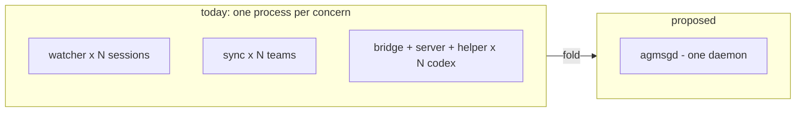
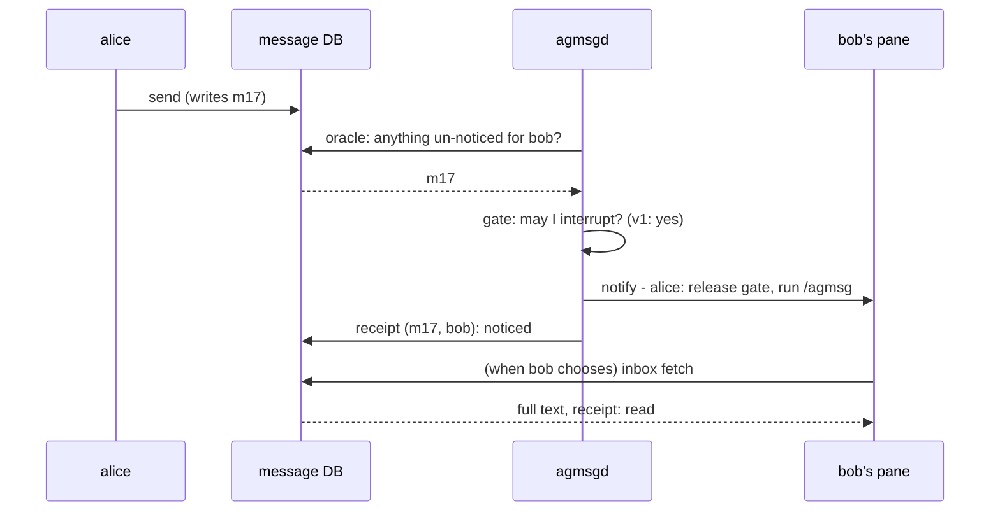

# RFC: agmsgd — a resident delivery daemon

This is an RFC: a request for comments on a design, not a decision record. Decisions land as ADRs as usual once settled — this is published first, so the shape can change while changing it is still cheap.

It assumes the terminal driver release has landed: every joined agent's pane has a name, and two commands work against that name — `peek` (look at an agent's screen without switching to it) and `poke` (type a line into its pane). If you have that release, you have everything this note builds on.

## What this buys you

This is a large change, so the benefits come first. Each of these is a thing you cannot have today:

1. **Messages stop getting lost.** Nothing is ever marked read until the agent actually fetches it. Today a broken or leftover watcher can consume messages that no one ever saw; after this change that failure is structurally impossible, and an untaken message stays visibly "delivered but unread" instead of vanishing.
2. **Notifications stop eating your agent's context.** Today, monitor mode pushes the full message text into the session — spending the agent's context window whether it wanted the message now or not. After this change the agent gets a one-line notification (sender + subject) and decides for itself when to spend the context on the full text.
3. **Codex works without the launch wrapper.** Real-time delivery to Codex no longer requires starting it through a wrapper — the single largest source of Codex bugs we have shipped — and a path opens for the Codex desktop app, which the wrapper could never support.
4. **One process instead of a fleet.** On one busy machine we counted roughly fifteen agmsg background processes (watchers, per-team sync, Codex helpers). They become one supervised daemon. When delivery misbehaves there is a single process to inspect.
5. **One agent name across tools, and messages to groups.** Your agent keeps one identity whether it runs on Claude Code or Codex, and one message can address a group tag with each recipient's state tracked separately (today: impossible on both counts).
6. **Groundwork for remote control.** The same machinery that executes `despawn` safely is what will later let you peek at a pane from your phone — with an explicit authorization model, not ad-hoc parsing.

## Why now

The trigger is concrete bugs. Several problems users actually hit came from managing that fleet of processes, not from messaging itself: a leftover watcher kept consuming messages for a role nobody held anymore; Codex sessions silently stopped receiving until relaunched; a project with no delivery settings was indistinguishable from one deliberately set to "off". Each got a point fix; the class keeps coming back. One supervised resident process removes the class.

## Summary of the change

**One resident daemon, `agmsgd`**, watches the message store and notifies each agent through its named pane. What changes for you:

- **Monitor mode**: the per-session watcher process disappears. Delivery looks similar from inside the session — but it is a one-line notification, and the daemon is doing it.
- **Codex**: no more launch wrapper (details in the Codex section).
- **Sending**: unchanged. `send` writes straight to the message database, daemon or no daemon. Without the daemon you lose automatic delivery, not messaging.

If you use agmsg daily — especially monitor mode, multi-machine teams, or Codex — your comments now are worth more than your bug reports later.

## Proposal

### One daemon

`agmsgd` is a single resident process (Node 22 or newer). It:

- watches the message database and runs the delivery loop (next section);
- runs multi-machine sync as one loop per team **inside the daemon** — no extra processes, and one team's expired credentials do not stop another team's sync;
- executes control messages (the kind behind `despawn`) itself instead of asking the receiving agent's LLM to act on them;
- can be registered with launchd / systemd at install time so it survives reboots — recommended, but **optional**: without it, everything except automatic delivery works unchanged.

### The delivery loop, concretely

Suppose `alice` sends `bob` a message at 09:00 while bob is in the middle of a task. The daemon runs three steps, named because the rest of the note refers to them:

1. **oracle** — *"does bob have anything it has not been told about?"* A plain read against the store: any message addressed to bob with no "noticed" record? Yes — the new one, call it m17. The oracle changes nothing; it only finds work. It also checks bob is registered and its process is alive — if not, the loop ends here and m17 simply waits.
2. **gate** — *"may I interrupt bob right now?"* A per-tool rule. **In v1 the answer is always yes**, for Claude Code and Codex alike, because the interruption is one typed line: if bob is mid-task, its CLI's own input queue holds the line and surfaces it when the turn ends. The gate exists as a named step because some future tool may need a rule like "not while X" — and because today's Codex bridge is, in effect, 900 lines of complicated gate. Poking makes that gate unnecessary; we keep the slot, not the complexity.
3. **notify** — type one line into bob's pane and record "noticed" for (m17, bob). If the typing fails — pane gone, terminal died — nothing is recorded and the next pass retries.

Note what is *not* in the loop: reading. Only bob's own inbox fetch marks m17 read. Today the watcher that displays a message also marks it read in the same breath — which is exactly how a broken watcher could consume messages nobody ever saw.

### Messages get a subject line — and search to match

Why one line instead of the full text? Because pushed text is spent context. An agent mid-task that receives three long messages has paid tokens for all three before deciding any of them mattered. A one-line notification inverts that: the agent sees one line per message and chooses what to fetch, when.

For that line to carry meaning, a message gains two optional fields:

- **subject** — one line, set by the sender: `send <team> <from> <to> --subject "release gate" "<long body...>"`
- **summary** — a few sentences for long bodies, also from the sender.

The line the daemon types into the recipient's pane looks like:

    [agmsg] alice: release gate (2 more unread) — run /agmsg to read

No subject? The first line of the body stands in, so old messages and lazy senders keep working unchanged.

Choosing *not* to fetch immediately is only viable if finding things later is cheap, so search ships alongside this. The model is the one you already know from Gmail: operators plus words, over subject, summary, and body, for example

    search 'from:alice subject:release after:2026-08-20 "drift"'
    search 'team:agmsg to:#devs before:2026-09-01'

— sender, recipient (including tags), date range, and free words, combinable. Subject and summary exist precisely to give that search something better to match than raw bodies.

### Who notifies: exactly one channel per session

For each delivery the daemon picks exactly one way to reach the recipient, based on where that session actually runs:

1. Session runs under a pane manager the daemon can control — tmux, herdr, or the agmsg desktop app? The daemon **pokes the named pane**: it types the notification line into the agent's terminal, the same way you would. One mechanism, identical for every agent type.
2. No pane manager? Fall back to what the tool itself offers: Claude Code has a channel a running session listens on; Codex takes deliveries at its hook points (see the Codex section).
3. Both would work at once — say, herdr managing panes that also live in tmux? The daemon uses the one **you are actually looking at**, and only that one. A message never arrives twice through two channels.

The daemon re-checks where a session runs at delivery time instead of trusting environment variables recorded earlier — in nested setups those go stale and lie.

### How the daemon knows where each agent is

The daemon can only notify a session it can find, so each session registers itself: "team X's agent *bob* is me — this session id, this process id, this pane of this terminal, this project." (In pub/sub terms this registration is the subscribe side; sending needs no registration at all.) It is created by the same step that names the pane:

- **Claude Code**: registration happens at session start (a SessionStart hook). Claiming a role — join or actas — points it at that name; dropping the role or ending the session removes it.
- **Codex**: Codex has no hook that fires at launch (its SessionStart fires on the first user turn), so the registration is created by the join / actas command the agent itself runs, and refreshed each time a Stop or PostToolUse hook fires.
- **Stale registrations cannot linger**: each carries a process id, the daemon checks the process is alive before delivering, and dead entries are collected. This permanently retires the "leftover watcher eats messages for a role nobody holds" bug.
- **No daemon running?** The registration call quietly does nothing, and everything else proceeds as today.

### Subscription replaces explicit role-claiming

Registering where a session is also settles *who* it is — which makes the separate step that exists today unnecessary.

Right now a session does two things. `join` puts a name in the team; `actas <name>` then declares "I am that name in this session", which takes an exclusivity lock and narrows what this session receives. The second step is explicit, repeated after every restart, and easy to get wrong — and getting it wrong is silent. A session that never claims a role receives *everything* addressed to any role registered for that project; a watcher started without the name argument does the same. Both look identical to a working setup until someone notices messages being marked read by a session that was never meant to see them. That failure has been reported and fixed under several numbers (#62, #300, #982) and re-appeared each time in a new shape, because the underlying arrangement — "you also have to say who you are, separately, every time" — stayed.

**Under agmsgd, a session always ends up with an identity.** Session start resolves one rather than waiting to be told: from the name `spawn` passed, from the role this session held last time, or — when the project has exactly one identity free — from that. Only a genuine ambiguity reaches the user, and because holding an identity is exclusive, the daemon can offer just the ones nobody is holding. Creating the first identity in a project is the same resolution with an empty set, not a separate first-run ceremony.

**A subscription is what an identity receives**, and it is durable: its own name, plus any tags it has subscribed to. It outlives the session, so a session that starts tomorrow picks up what that identity was already listening to. Binding a session to an identity is the exclusive part — one session at a time, which is exactly today's lock, now taken automatically instead of typed.

`actas` does not disappear so much as become the exception it should always have been: switching a session to a *different* identity on purpose. What it used to be — the thing you had to remember every time — is gone.

**Forgetting now costs nothing.** A session with no identity receives nothing at all, rather than everything addressed to everyone in the project. The dangerous default inverts: the failure that produced #300 and #982 was "unspecified means receive it all", and the failure here is a quiet inbox you notice immediately and nobody else is harmed by.

### What the separation makes possible

**One message to a group.** `to:#devs` reaches every identity subscribed to that tag, and each carries its own noticed/read state: three read it, two have not, and that is visible. Today the same announcement is N separate sends with no way to see who picked it up.

**Tags are subscribed to, not administered.** A tag comes into existence when the first identity subscribes to it and ceases to exist when the last one leaves — no registry to curate, no cleanup of tags nobody uses, and no way to end up with a tag that exists but reaches no one. The count is over identities rather than live sessions, so `#devs` is still there in the morning. `#all` is the exception in both directions: it exists from the moment a team does, every identity is subscribed implicitly, and none can unsubscribe.

**Addressing a tag nobody subscribes to is an error**, not a delivery to zero recipients. A message to `#dev` when the tag is `#devs` fails loudly instead of succeeding into nothing.

**Several teams from one session.** An identity is one per team and a session can hold several across teams, so one seat can work in more than one team without a separate window for each.

**Nothing to re-declare after a restart.** Subscriptions belong to the identity, so they survive; binding is resolved at session start. There is no ceremony left to forget.

**`from` becomes something that is actually protected.** Measured: `send` does not consult the exclusivity lock at all today, so any registered name can be sent as. Holding the identity is the first mechanism that makes a sender's name mean anything.

### One name, many tools; one message, many recipients

Two changes you will notice directly, enabled by one storage change each:

**Your agent is (team, name), nothing more.** Today the store keys a registration by (team, name, *tool type*), so "the same agent" on Claude Code and on Codex are two different registrations. That is the root cause of duplicate-registration confusion users have reported, and the reason ownership checks on leave / despawn are hard to add. After the change, `bob` is `bob` — whichever tool it happens to be running on today — and "who may remove bob" finally has a single answer to attach rules to.

**Messages to groups, with per-recipient tracking.** A message can address a tag — say `#devs` — and every member holding that tag gets its own notification and its own noticed/read state. Concretely, the delivery marks move off the message row into one row per (message, recipient):

    today:     messages: id | from | to | body | created_at | notified_at | read_at
    proposed:  messages: id | from | to | subject | summary | body | created_at
               receipts: message_id | team | recipient | noticed_at | read_at

A worked timeline:

    09:00  alice sends "release gate" to #devs   -> message m17; no receipts yet
    09:00  daemon notifies bob and carol         -> receipts (m17,bob) (m17,carol): noticed
    09:03  bob fetches its inbox               -> receipt (m17,bob): read
    ...    carol never fetches                  -> (m17,carol) stays noticed-but-unread: visible

Sending to one name is just the one-recipient case of the same mechanism.

### Groundwork: a control channel no LLM interprets

Some traffic is commands, not conversation. Today's example is `despawn` (tear down an agent): it travels as a message, and the *receiving LLM* is expected to read it and comply — which means safety depends on a model interpreting text. Under agmsgd, command messages are executed by the daemon, mechanically, by kind; they never reach an LLM.

v1 deliberately ships only one command — despawn, through the terminal driver (which also fixes graceful teardown being tmux-only today). The reason this section exists is what comes after, and we want opinions on this mechanism before more command kinds are added:

- **remote peek / poke** — from another machine or a phone: "show me bob's screen", "type this into carol's pane", arriving over sync and executed locally by the daemon;
- **an authorization model** — before more commands exist, "who may issue which command to whom" needs an explicit, inspectable answer;
- further candidates like pause / handoff follow only behind that gate.

"The daemon executes commands" can sound alarming, so here is the security posture, stated plainly:

- **Commands are typed, never free text.** A command is a kind plus structured arguments with a schema. The daemon never executes anything written in a message body, and no shell is involved anywhere.
- **Default deny.** The only command v1 honors is despawn, under the same conditions it works today (issued within the same team, on the same machine). Every other kind is rejected.
- **Remote is off by default.** A command arriving over multi-machine sync is ignored unless you have explicitly enabled that command kind for that team on the receiving machine — per team, per kind.
- **Everything is logged.** Accepted and rejected commands both leave a local record of who asked for what, so the history is auditable.
- The allowlist model ("these senders may issue these kinds to these targets") ships as its own ADR before any second command kind exists — that ADR is exactly the thing we want comments on.

### Delivery mode chosen automatically

The four-way question at join time (monitor / turn / both / off) goes away. The daemon picks the best available mode for the session's environment; an explicit setting still overrides it. As a side effect, "no settings file" and "deliberately off" stop being the same state.

### What happens to multi-machine sync

Today, syncing a team with other machines runs a **separate long-lived process per team**, started on demand and tracked by a pidfile. That arrangement has the same shape of problem as the watchers: the process is outside anything that supervises it, and the only record of it is a file that a second start can overwrite. On one machine while writing this note, a single team turned out to have *two* engines running eight minutes apart, with the pidfile naming only the later one — the earlier one still syncing, still writing the team's log, and unreachable by `stop`, `restart`, or status, because all three consult the pidfile (#1103).

Under agmsgd, sync is **one loop per team inside the daemon**:

- **No separate processes.** Nothing to orphan, nothing to lose track of, no pidfile as the sole record of what is running. What is syncing is whatever the daemon says is syncing.
- **Failures stay per team.** One team's expired credentials or unreachable server stops that team's loop and nothing else — the property the per-process design was reaching for, kept.
- **One place to ask.** Cycle counts, last success, and the current error for every team come from the daemon in one status call, instead of a pidfile plus a log file per team.

What does **not** change, and is worth stating because it is easy to assume otherwise: **sync never notifies.** Its job is to bring messages onto this machine — it writes rows and stops there. Whether an agent is told about a message is the delivery loop's decision, on this machine, using the same `noticed` bookkeeping as a locally sent message. Sync copies; the daemon notifies. Keeping those separate is what makes "a message arrived from another machine" and "a message was sent next to me" behave identically from the agent's side.

Sub-commands keep working: starting and stopping sync for a team stays a thing you can ask for, it just addresses a loop in the daemon rather than spawning and killing a process.

### What this means for Codex specifically

Real-time delivery to Codex today requires launching it through a wrapper script so that a helper process (the "bridge") can reach it. That wrapper is the single largest source of Codex-related bugs we have shipped — orphaned helper processes, respawn loops, races at launch — and it cannot work with the Codex desktop app at all, since the app controls its own launch.

Under this proposal, Codex delivery uses two official mechanisms and nothing else: its hooks (end of turn, and after each tool call while a turn runs) and, when it runs in a managed pane, a poke like any other agent. **Neither changes how Codex starts.** The one situation left uncovered is a Codex session in a bare terminal — no tmux, no herdr — sitting idle: nothing fires a hook, and there is no pane to poke. For exactly that case the old bridge remains available as an opt-in fallback, and we expect to retire even that once we can verify whether Codex's own shared app-server daemon (new in recent Codex versions) lets an ordinarily-launched session be reached from outside.

The **Codex desktop app** is tracked as its own environment. Its sandboxing means an agent inside it cannot write the message database directly, so sends from inside the app go through a small hand-off: the agent writes a request file, the daemon applies it to the database, and the agent reports "sent" only after the daemon confirms — if the daemon is not there to confirm, the send fails with an explicit error instead of pretending. (Today the same situation fails silently, which is worse.) A few facts about the app are still unmeasured; this note will be updated as they land.

## Compatibility and migration

The intent is that **nothing you type today changes meaning**, and the visible differences are all removals of friction. In detail:

| you do today | after this change |
|---|---|
| `send`, `inbox`, `history` | identical commands, identical behavior (plus subject/summary options and search) |
| answer the 4-way delivery prompt at join | prompt gone; mode auto-detected, explicit setting still wins |
| see watcher processes in `ps` | one `agmsgd` process |
| start Codex through the wrapper for monitor mode | start Codex normally |
| `despawn` asks the target LLM to comply | daemon executes it; same command, more reliable |
| debug delivery by hunting processes | ask the daemon: one status command lists registrations, last deliveries, sync state |

What runs where:

| capability | with daemon | without daemon |
|---|---|---|
| send / inbox / history / search | yes | yes |
| automatic delivery (notifications) | yes | no — check inbox manually or via turn-end hooks |
| multi-machine sync | continuous, supervised | manual pull still works |
| despawn / future control commands | yes | no |
| dependency | Node 22+ | bash + sqlite only |

Migration facts:

- Team stores, registrations, and settings migrate in place; the rules ship with the implementation, and old single-recipient columns are carried into the receipts table mechanically.
- The bash + sqlite dependency line for plain messaging is kept on purpose: a machine that cannot run Node can still send and read.
- The Codex bridge is not deleted on day one: it becomes opt-in, off by default, for the one uncovered case (bare-terminal idle Codex).

## Open questions (where comments help most)

Each of these is a decision we can still change cheaply. A one-line answer ("yes, I actually do X") is enough.

1. **Auto-selected delivery mode.** The daemon will pick how to deliver by looking at your environment (is there a pane manager? which tool?). Is there a setup you run where that guess would be wrong — where you would want a different mode than the obvious one?
2. **Noticed is not read.** After the change, a message shown as a one-line notification is not marked read; only an inbox fetch marks it. Do you have scripts or habits that assume "the watcher displayed it, therefore it is read"?
3. **One identity per (team, name).** "The same" agent name on two tools becomes one identity instead of two registrations. Does anyone run same-name-on-different-tools on purpose, needing them kept separate?
4. **Search.** What do you actually need to find — by sender, date, words, team? How far back? Would Gmail-style operators (from:, after:, subject:) cover your cases?
5. **Control commands.** Beyond despawn, what would you require before enabling remote peek / poke on one of your machines — per-team opt-in, sender allowlists, an audit log, something else?
6. **Daemonless fallback.** We plan to keep agmsg usable without the daemon (manual inbox checks, no automatic delivery). Would you actually run that way, or should we simplify and require the daemon?
