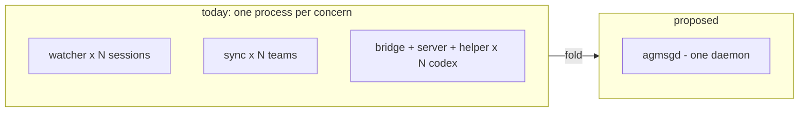
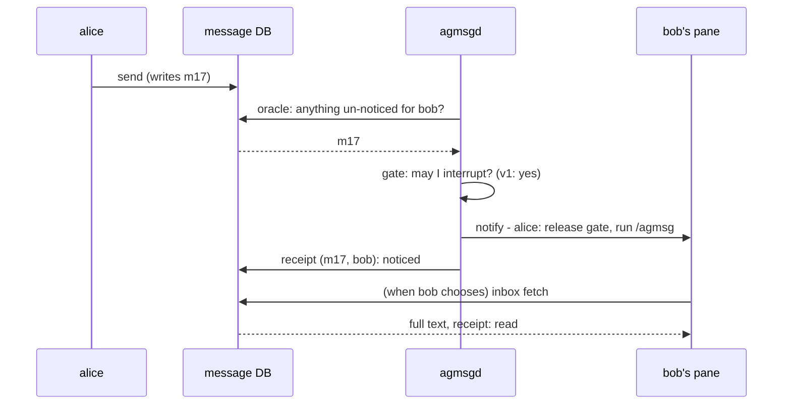

# RFC: agmsgd — a resident delivery daemon

This is an RFC: a request for comments on a design, not a decision record. Decisions land as ADRs as usual once settled — this is published first, so the shape can change while changing it is still cheap.

> **Status (2026-09-28).** The direction described here has been approved, and this note now matches it. What changed since the first version is listed in [Changes since the first version](#changes-since-the-first-version). The architecture design (how each part works) is done and published next to this note as [agmsgd-architecture.md](agmsgd-architecture.md). Next is the technical design (where the source lives, how it is built and shipped); implementation follows after that. Every release has to be something that can be stopped, and none is built all at once. Thank you to everyone who answered the open questions in the discussion — the answers are reflected below.

It assumes the terminal driver released in 1.3.0. What that release added underneath — and what this builds on — is **identity at the terminal layer**: a pane knows which agent occupies it, the same way under tmux and under herdr, and that binding is recorded, checkable and repairable. `peek`, `poke` and `arrange` are conveniences built on the same naming. They are not what a delivery daemon needs; what it needs is to resolve an addressee to a place, and that is what 1.3.0 made possible.

## What this buys you

This is a large change, so the benefits come first. Each of these is a thing you cannot have today:

1. **Messages stop getting lost.** Nothing is ever marked read until the agent actually fetches it. Today a broken or leftover watcher can consume messages that no one ever saw; after this change that failure is structurally impossible, and an untaken message stays visibly "delivered but unread" instead of vanishing.
2. **Notifications stop eating your agent's context.** Today, monitor mode pushes the full message text into the session — spending the agent's context window whether it wanted the message now or not. After this change the agent gets a one-line notification (sender + subject) and decides for itself when to spend the context on the full text.
3. **Codex works without the launch wrapper.** Real-time delivery to Codex no longer requires starting it through a wrapper — the single largest source of Codex bugs we have shipped. (The Codex desktop app is not covered in the first version; see the Codex section.)
4. **One process instead of a fleet.** On one busy machine we counted roughly fifteen agmsg background processes (watchers, per-team sync, Codex helpers). They become one supervised daemon. When delivery misbehaves there is a single process to inspect.
5. **One agent name across tools, and messages to groups.** Your agent keeps one identity whether it runs on Claude Code or Codex, and one message can address a group tag with each recipient's state tracked separately (today: impossible on both counts).
6. **Groundwork for remote control.** The same machinery that executes `despawn` safely is what will later let you peek at a pane from your phone — with an explicit authorization model, not ad-hoc parsing.

```mermaid
flowchart LR
  subgraph today["today: one process per concern"]
    w1[watcher x N sessions]
    s1[sync x N teams]
    c1[bridge + server + helper x N codex]
  end
  subgraph after["proposed"]
    d[agmsgd - one daemon]
  end
  today -->|fold| after
```

## Why now

The trigger is concrete bugs. Several problems users actually hit came from managing that fleet of processes, not from messaging itself: a leftover watcher kept consuming messages for a role nobody held anymore; Codex sessions silently stopped receiving until relaunched; a project with no delivery settings was indistinguishable from one deliberately set to "off". Each got a point fix; the class keeps coming back. One supervised resident process removes the class.

## Summary of the change

**One resident daemon, `agmsgd`**, watches the message store and notifies each agent through its named pane. What changes for you:

- **Monitor mode**: the per-session watcher process disappears. Delivery looks similar from inside the session — but it is a one-line notification, and the daemon is doing it.
- **Codex**: no more launch wrapper (details in the Codex section).
- **Sending**: unchanged. `send` writes straight to the message database, daemon or no daemon. Without the daemon you lose automatic delivery, not messaging.

It ships in this order:

1. **1.3.1** — clients skip message fields they do not know yet (released).
2. **Re-reading what an older client set aside** — after an upgrade, the client re-reads the stored originals it could not understand before (released).
3. **A shared id, subject and summary on every new message** (1.x).
4. **Groundwork** (1.x) — the records for which session holds which name, the check at send time, a migration check (`agmsg migrate --check`) you can run as often as you like, and a warning at join when a name already exists elsewhere.
5. **2.0.0** — everything that is not backward compatible, together: the new store (per-recipient receipts, tags, and the one step in this whole design that cannot be undone; see [Compatibility and migration](#compatibility-and-migration)), delivery by the daemon, sync moved into the daemon, and the join / drop / leave vocabulary. Release candidates (2.0.0-rc) come first, to check it on real machines.

Steps 1 to 4 are each usable on their own. The new store and the daemon ship together on purpose: the store switch alone would bring the break without the benefit.

Two unrelated pieces came before step 3: external-tool invocation (released in 1.4.0, which also carries step 2) and a terminal driver for Orca (released in 1.5.0).

If you use agmsg daily — especially monitor mode, multi-machine teams, or Codex — your comments now are worth more than your bug reports later.

## Proposal

### One daemon

`agmsgd` is a single resident process (Node 22.13 or newer), one per agmsg install. It:

- watches the message database and runs the delivery loop (next section);
- runs multi-machine sync as one loop per team **inside the daemon** — no extra processes, and one team's expired credentials do not stop another team's sync;
- executes control messages (the kind behind `despawn`) itself instead of asking the receiving agent's LLM to act on them;
- can be registered with launchd / systemd at install time so it survives reboots — recommended, but **optional**: without it, everything except automatic delivery works unchanged.

`agmsgd` is the name of the process — what you see in `ps` and what a service manager starts. It is not a command you type. The one command you type is `agmsg`, which arrives before 2.0.0; the daemon is controlled from it too (`agmsg daemon start`, `stop`, `status`). `agmsg` itself works without the daemon.

### The delivery loop, concretely

Suppose `alice` sends `bob` a message at 09:00 while bob is in the middle of a task. The daemon runs three steps, named because the rest of the note refers to them:

1. **oracle** — *"does bob have anything it has not been told about?"* A plain read against the store: any message addressed to bob with no "noticed" record? Yes — the new one, call it m17. The oracle changes nothing; it only finds work. It also checks bob is registered and its process is alive — if not, the loop ends here and m17 simply waits.
2. **gate** — *"may I interrupt bob right now?"* A per-tool rule. **In v1 the answer is always yes**, for Claude Code and Codex alike, because the interruption is one typed line and the CLI keeps it. Measured for Claude Code: a line typed while it is working is neither lost nor mixed into other input, and it does not stop the running command; the CLI takes it in at its next break (the next tool result) as additional input to the current turn. The gate exists as a named step because some future tool may need a rule like "not while X" — and because today's Codex bridge is, in effect, 900 lines of complicated gate. Poking makes that gate unnecessary; we keep the slot, not the complexity.
3. **notify** — type one line into bob's pane and record "noticed" for (m17, bob). If the typing fails — pane gone, terminal died — nothing is recorded and the next pass retries.

```mermaid
sequenceDiagram
  participant alice
  participant DB as message DB
  participant d as agmsgd
  participant bob as bob's pane
  alice->>DB: send (writes m17)
  d->>DB: oracle: anything un-noticed for bob?
  DB-->>d: m17
  d->>d: gate: may I interrupt? (v1: yes)
  d->>bob: notify - alice: release gate, run /agmsg
  d->>DB: receipt (m17, bob): noticed
  bob->>DB: (when bob chooses) inbox fetch
  DB-->>bob: full text, receipt: read
```

Note what is *not* in the loop: reading. Only bob's own inbox fetch marks m17 read. Today the watcher that displays a message also marks it read in the same breath — which is exactly how a broken watcher could consume messages nobody ever saw.

What the loop promises, stated with its limits:

- **Notifications are at-least-once.** Because the loop retries, a notification can occasionally appear twice. The read state is not affected by that.
- **A pane is best effort.** A pane has no receiving side that can refuse a stale line, so a notification written to a pane can still arrive late, or twice. For a pane, "noticed" is recorded when the line is written.
- **Codex hooks mark read when they hand the message over**, as they do today. They are not re-notified.
- **A notification is not a read.** Only an inbox fetch (or a hook handing over the body) marks a message read. `history` and search never change read state.
- **A receipt says stored, notified, or fetched — nothing more.** It does not say the recipient accepted the work or finished it.
- At session start, the agent gets one line with its unread count. That line does not mark anything read.

### Messages get a subject line — and search to match

Why one line instead of the full text? Because pushed text is spent context. An agent mid-task that receives three long messages has paid tokens for all three before deciding any of them mattered. A one-line notification inverts that: the agent sees one line per message and chooses what to fetch, when.

For that line to carry meaning, a message gains optional fields, set by the sender:

- **subject** — one line, up to 200 characters: `send <team> <from> <to> --subject "release gate" "<long body...>"`
- **summary** — a few sentences for long bodies, up to 1000 characters. The summary is for search; it is not put in the notification.

Every new message also carries a **shared id**, assigned once when it is created, so the same message has the same id on every machine and every server. These three fields travel with the message (see [What happens to multi-machine sync](#what-happens-to-multi-machine-sync)).

The line the daemon types into the recipient's pane carries the sender, the subject and the recipient's unread count (including this message), in a fixed tagged form:

    <agmsg-notice from="alice" unread="3">release gate</agmsg-notice>

A summary line (unread messages from before the migration, or at session start) has no sender and fixed text:

    <agmsg-notice unread="12">12 unread messages. Run /agmsg to read them.</agmsg-notice>

Two limits are stated plainly:

- **The tag protects the syntax only.** Text taken from a message (a subject, say) is escaped, so it cannot break out of the tag or fake another notification. It cannot stop the text inside the tag from being read as an instruction; the agmsg skill tells agents that a notification line is a notice, not something the user typed.
- **The sender in the line is the name matched against the team roster.** It is not authentication.

No subject? The first line of the body stands in, so old messages and senders who skip the subject keep working unchanged.

Choosing *not* to fetch immediately is only viable if finding things later is cheap, so search is part of the plan. The model is the one you already know from Gmail: operators plus words, over subject, summary, and body, for example

    search 'from:alice subject:release after:2026-08-20 "drift"'
    search 'team:agmsg to:#devs before:2026-09-01'

— sender, recipient (including tags), date range, and free words, combinable. The exact command shape is still open.

### Who notifies: exactly one channel per session

For each delivery the daemon picks exactly one way to reach the recipient. It decides **per registration**, from whether the terminal driver could resolve that session's pane — not from whether some pane manager happens to be running on the machine:

1. **The pane resolved** (tmux, herdr, Orca, or the agmsg desktop app)? The daemon **writes the notification into that pane**, through the same terminal driver that knows which agent occupies which pane. One mechanism, identical for every agent type. This is not the `poke` command: that one is a convenience for an agent deliberately typing into another agent's pane, and the daemon is not an agent — it is delivering a message to its addressee, which happens to travel the same way.
2. **Confirmed that there is no pane?** Fall back to what the tool itself offers: Claude Code receives through the process a Monitor runs for the session (its standard output); Codex takes deliveries at its hook points (see the Codex section).
3. **Cannot tell?** The daemon does not guess. It does not deliver to that session, and says why in its status.

If two channels would work at once — say, herdr managing panes that also live in tmux — the daemon uses the one **you are actually looking at**, and only that one. A message never arrives twice through two channels.

The daemon re-checks where a session runs at delivery time, from the terminal side, instead of trusting environment variables recorded earlier — in nested setups those go stale and lie.

### How the daemon knows where each agent is

The daemon can only notify a session it can find, so each session registers itself: "team X's agent *bob* is me — this session id, this process id, this pane of this terminal, this project." (In pub/sub terms this registration is the subscribe side; sending needs no registration at all.) The location comes from the terminal side, both when the session registers and when a message is delivered.

- **Claude Code**: registration happens at session start (a SessionStart hook).
- **Codex**: Codex has no hook that fires at launch, so it resolves its identity at the hook of its first turn.
- **Stale registrations cannot linger**: each carries a process id, the daemon checks the process is alive before delivering, and dead entries are collected. This permanently retires the "leftover watcher eats messages for a role nobody holds" bug.
- **Reconnecting never falls back to an older record.** When a session comes back, ownership goes to the session doing the work now.
- **No daemon running?** The registration call quietly does nothing, and everything else proceeds as today.

### Subscription replaces explicit role-claiming

Registering where a session is also settles *who* it is — which makes the separate step that exists today unnecessary.

Right now a session does two things. `join` puts a name in the team; `actas <name>` then declares "I am that name in this session", which takes an exclusivity lock and narrows what this session receives. The second step is explicit, repeated after every restart, and easy to get wrong — and getting it wrong is silent. A session that never claims a role receives *everything* addressed to any role registered for that project; a watcher started without the name argument does the same. Both look identical to a working setup until someone notices messages being marked read by a session that was never meant to see them. That failure has been reported and fixed under several numbers (#62, #300, #982) and re-appeared each time in a new shape, because the underlying arrangement — "you also have to say who you are, separately, every time" — stayed.

**Under agmsgd, a session always ends up with an identity.** Installing agmsg makes session start use it by default, and session start resolves an identity rather than waiting to be told: from the name `spawn` passed, from the role this session held last time, or — when the project has exactly one identity free — from that. Only a genuine ambiguity reaches the user, and because holding an identity is exclusive, the daemon can offer just the ones nobody is holding. Creating the first identity in a project is the same resolution with an empty set, not a separate first-run ceremony.

**A subscription is what an identity receives**, and it is durable: its own name, plus any tags it has subscribed to. It outlives the session, so a session that starts tomorrow picks up what that identity was already listening to. Binding a session to an identity is the exclusive part — one session at a time, which is exactly today's lock, now taken automatically instead of typed.

The commands keep the meaning they have today. `join`, `actas` and `drop` bind a session to an identity or release it; `leave` removes the identity from the team. A name, once used, stays reserved; names are not released in v1. After `drop` or `leave`, that name is not attached automatically at the next session start in that project until you `join` (or `actas`) again. `actas` does not disappear so much as become the exception it should always have been: switching a session to a *different* identity on purpose.

**A session with no identity cannot use agmsg at all** — it neither receives nor sends. It is not a quiet default that receives everything: the failure that produced #300 and #982 was "unspecified means receive it all". A seat that should stay out of agmsg is set that way with an explicit command; it stays out until someone runs a command to bring it back.

### What the separation makes possible

**One message to a group.** `to:#devs` reaches every identity subscribed to that tag, and each carries its own noticed/read state: three read it, two have not, and that is visible. Today the same announcement is N separate sends with no way to see who picked it up. The recipients are fixed when the message is sent; someone who subscribes later does not receive earlier messages.

**Tags are subscribed to, not administered.** A tag comes into existence when the first identity subscribes to it and ceases to exist when the last one leaves — no registry to curate, no cleanup of tags nobody uses, and no way to end up with a tag that exists but reaches no one. The count is over identities rather than live sessions, so `#devs` is still there in the morning. `#all` is the exception in both directions: it exists from the moment a team does, every identity is subscribed implicitly, and none can unsubscribe.

**Addressing a tag nobody subscribes to is an error**, not a delivery to zero recipients. A message to `#dev` when the tag is `#devs` fails loudly at send time instead of succeeding into nothing.

**Several teams from one session.** An identity is one per team and a session can hold several across teams, so one seat can work in more than one team without a separate window for each.

**Nothing to re-declare after a restart.** Subscriptions belong to the identity, so they survive; binding is resolved at session start. There is no ceremony left to forget.

**`from` becomes something that is actually protected.** Measured: `send` does not consult the exclusivity lock at all today, so any registered name can be sent as. Holding the identity is the first mechanism that makes a sender's name mean anything: a session that has lost its hold on a name can no longer send as it. When a send is refused, the message says which of three things happened — the name is being handed over (try again in a few seconds), it moved to another session (do not retry; take it back or use your own name), or a handover was interrupted and is waiting to be cleaned up (the next agmsg command cleans it up). An interrupted handover is also cleaned up lightly on its own, at session start and at hook time. What is not protected is the screen: a late notification line can still appear in a pane.

**Exclusivity is per agmsg install.** Within one install, one session at a time holds a given name, even if the install keeps several stores. Another install — another machine, or a second copy on the same machine — is another world: if the same name is used there too, both receive, and agmsg shows the conflict as a diagnostic. Keeping that from happening is up to you for now; exclusivity enforced by a server may be considered later if it becomes a real problem.

### One name, many tools; one message, many recipients

Two changes you will notice directly, enabled by one storage change each:

**Your agent is (team, name), nothing more.** Today the store keys a registration by (team, name, *tool type*), so "the same agent" on Claude Code and on Codex are two different registrations. That is the root cause of duplicate-registration confusion users have reported, and the reason ownership checks on leave / despawn are hard to add. After the change, `bob` is `bob` — whichever tool it happens to be running on today — and "who may remove bob" finally has a single answer to attach rules to. Folding the old keys together is part of the store switch. Several registrations under one name (say `bob` on Claude Code and `bob` on Codex) are fine: both stay, and as today only one session can hold the name at a time. The switch stops and asks you to choose only when the fold would be ambiguous: the same name carries two different member ids, or two live owners claim it. It never silently picks one.

**Messages to groups, with per-recipient tracking.** A message can address a tag — say `#devs` — and every member holding that tag gets its own notification and its own noticed/read state. Concretely, the delivery marks move off the message row into one row per (message, recipient). Illustratively (the actual tables are settled in the architecture design):

    today:     messages: id | from | to | body | created_at | notified_at | read_at
    proposed:  messages: id | from | to | subject | summary | body | created_at
               receipts: message_id | team | recipient | noticed_at | read_at

(`notified_at` exists only in stores upgraded from some older versions.)

A worked timeline:

    09:00  alice sends "release gate" to #devs   -> message m17; no receipts yet
    09:00  daemon notifies bob and carol         -> receipts (m17,bob) (m17,carol): noticed
    09:03  bob fetches its inbox               -> receipt (m17,bob): read
    ...    carol never fetches                  -> (m17,carol) stays noticed-but-unread: visible

Sending to one name is just the one-recipient case of the same mechanism.

### Groundwork: a control channel no LLM interprets

Some traffic is commands, not conversation. Today's example is `despawn` (tear down an agent): it travels as a message, and the *receiving LLM* is expected to read it and comply — which means safety depends on a model interpreting text. Under agmsgd, command messages are executed by the daemon, mechanically, by kind; they never reach an LLM.

v1 deliberately ships only one command — despawn, through the terminal driver (which also fixes graceful teardown being tmux-only today). The daemon only ever does the graceful form: success means the name was released, not that the pane was closed. Forcing a pane closed stays something a person does directly with `despawn.sh --force`. A despawn request that waited while no daemon was running is carried out only within its time limit (10 minutes by default) and only if the target is still the same session; otherwise it is returned as expired. A narrow window remains in which a request can run just after its limit; the worst case is that the named session is released late, never that a different session is.

The reason this section exists is what comes after, and we want opinions on this mechanism before more command kinds are added:

- **remote peek / poke** — from another machine or a phone: "show me bob's screen", "type this into carol's pane", arriving over sync and executed locally by the daemon;
- **an authorization model** — before more commands exist, "who may issue which command to whom" needs an explicit, inspectable answer;
- further candidates like pause / handoff follow only behind that gate.

"The daemon executes commands" can sound alarming, so here is the security posture, stated plainly:

- **Commands are typed, never free text.** A command is a kind plus structured arguments with a schema. The daemon never executes anything written in a message body, and no shell is involved anywhere.
- **Default deny.** The only command v1 honors is despawn, under the same conditions it works today (issued within the same team, on the same machine). Every other kind is rejected.
- **Remote is off by default.** A command arriving over multi-machine sync is ignored unless you have explicitly enabled that command kind for that team on the receiving machine — per team, per kind.
- **Everything is logged.** Accepted and rejected commands both leave a local record of who asked for what, so the history is auditable.
- The allowlist model ("these senders may issue these kinds to these targets") ships as its own ADR before any second command kind exists — that ADR is exactly the thing we want comments on.

Remote peek / poke is not in v1.

### Delivery mode chosen automatically

The four-way question at join time (monitor / turn / both / off) goes away. The daemon picks the delivery channel for each registration as described in [Who notifies](#who-notifies-exactly-one-channel-per-session); an explicit setting still overrides it. As a side effect, "no settings file" and "deliberately off" stop being the same state.

### External tools

Calling an external tool on an incoming message (released as a preview in 1.4.0) becomes one of the daemon's deliveries once the daemon ships. The contract with the tool adapter does not change. What the daemon adds is care about retries, because a tool can have side effects outside agmsg that cannot be taken back:

- It retries only when it is certain the tool never started. If it cannot tell whether the tool started, it reports the result as unknown instead of running it again.
- It never runs the same message through the same tool twice.
- A reply the tool produced is kept; if sending the reply fails, only the sending is retried.

The opposite direction from notifications is deliberate: a notification would rather appear twice than be lost; a tool run would rather fail once, visibly, than run twice.

### Seeing what the daemon is doing

"Nothing fails silently" only holds if you can see what the daemon is doing. One status view shows:

- which sessions it serves, the channel it chose for each and why, and which registrations are not here versus here but broken;
- recent deliveries, and unread counts split into never-notified and notified-but-unread;
- sync state per team, including rows set aside and rows that cannot be recovered;
- anything stopped, and why — including requests waiting because the daemon cannot tell something;
- results of control commands (run, refused, expired, cancelled) and of external-tool runs (done, failed, result unknown);
- versions of the daemon, the store and connected clients.

Every item is an observed fact with the time it was observed, not a promise about the present. If the daemon cannot be reached, the view says so and shows the last thing recorded, rather than pretending to be complete. v1 provides this at least on the command line. It shows what this install sees; looking at other machines or across teams at once is not in v1.

### What happens to multi-machine sync

Today, syncing a team with other machines runs a **separate long-lived process per team**, started on demand and tracked by a pidfile. That arrangement has the same shape of problem as the watchers: the process is outside anything that supervises it, and the only record of it is a file that a second start can overwrite. On one machine while writing this note, a single team turned out to have *two* engines running eight minutes apart, with the pidfile naming only the later one — the earlier one still syncing, still writing the team's log, and unreachable by `stop`, `restart`, or status, because all three consult the pidfile (#1103).

Under agmsgd, sync is **one loop per team inside the daemon**:

- **No separate processes.** Nothing to orphan, nothing to lose track of, no pidfile as the sole record of what is running. What is syncing is whatever the daemon says is syncing.
- **Failures stay per team.** One team's expired credentials or unreachable server stops that team's loop and nothing else — the property the per-process design was reaching for, kept.
- **One place to ask.** Cycle counts, last success, and the current error for every team come from the daemon in one status call, instead of a pidfile plus a log file per team.

What does **not** change, and is worth stating because it is easy to assume otherwise: **sync never notifies.** Its job is to bring messages onto this machine — it writes rows and stops there. Whether an agent is told about a message is the delivery loop's decision, on this machine, using the same `noticed` bookkeeping as a locally sent message. Sync copies; the daemon notifies. Keeping those separate is what makes "a message arrived from another machine" and "a message was sent next to me" behave identically from the agent's side.

What travels, and what does not:

- **The content of a message is synced, all of it** — including the new shared id, subject and summary. No server change is needed: clients from 1.3.1 on skip fields they do not know, so the new fields simply ride along.
- **The state of a machine is not synced.** "Noticed" records, which session holds which name, and delivery records stay on the machine they belong to.
- **Read state is synced only for messages that carry the shared id.** Messages from before that release have no shared id; their read state stays local and is not carried to a new server.
- **A message to a tag travels as one ordinary row per recipient**, written by the sender. Subscriptions travel through the team's roster journal.
- **After an upgrade, a client re-reads the originals it stored.** One idempotent pass fills in every field the new version understands. It never hides a message that was already visible: if a re-read value turns out to be invalid or to conflict, the row stays an ordinary old-format message and the count is shown. New incoming rows with an invalid or conflicting id are set aside, as before.
- **Integrity comes from encryption.** The receiver no longer rebuilds a message and demands a byte-for-byte match (removed in 1.3.1, #1282). Encrypted teams get integrity from their encryption, which rejects altered rows at decryption. Plain teams have no integrity protection, as before.

If the same identity runs on two machines, both receive. Read state converges, because reads only ever move from unread to read.

Sub-commands keep working: starting and stopping sync for a team stays a thing you can ask for, it just addresses a loop in the daemon rather than spawning and killing a process.

### What this means for Codex specifically

Real-time delivery to Codex today requires launching it through a wrapper script so that a helper process (the "bridge") can reach it. That wrapper is the single largest source of Codex-related bugs we have shipped — orphaned helper processes, respawn loops, races at launch.

Under this proposal, Codex delivery uses two official mechanisms and nothing else: its hooks (end of turn, and after each tool call while a turn runs) and, when it runs in a pane the terminal driver resolved, the same write into the pane that every other agent type receives. **Neither changes how Codex starts.** The one situation left uncovered is a Codex session with no pane — a bare terminal, or a headless worker — sitting idle: nothing fires a hook, and there is no pane to write to. Such a session receives at its next turn. Running it inside tmux, herdr or another supported pane manager makes it reachable while idle. For that uncovered case the old bridge remains available as an opt-in fallback, and we expect to retire even that once we can verify that recent Codex versions let an ordinarily-launched session be reached from outside.

The **Codex desktop app** is not covered by the first version. Supporting it is on the roadmap.

## Compatibility and migration

The intent is that **nothing you type today changes meaning**, and the visible differences are all removals of friction. In detail:

| you do today | after this change |
|---|---|
| `send`, `inbox`, `history` | identical commands, identical behavior (plus subject/summary options and search) |
| answer the 4-way delivery prompt at join | prompt gone; channel chosen per registration, explicit setting still wins |
| see watcher processes in `ps` | one `agmsgd` process |
| start Codex through the wrapper for monitor mode | start Codex normally |
| `despawn` asks the target LLM to comply | the daemon executes it (graceful only); `despawn.sh`, run yourself, keeps working without the daemon |
| debug delivery by hunting processes | ask the daemon: one status view lists registrations, deliveries, sync state, and anything stopped |

What runs where:

| capability | with daemon | without daemon |
|---|---|---|
| send / inbox / history / search | yes | yes |
| automatic delivery (notifications) | yes | Claude Code: yes, a thin version run by its Monitor; other tools: no — check inbox manually or via turn-end hooks |
| multi-machine sync | continuous, supervised | manual pull still works |
| despawn run by the daemon / future control commands | yes | no (`despawn.sh` run yourself still works) |
| dependency | Node 22.13+ | bash + sqlite only |

Migration facts:

- **Upgrade every machine to 1.3.1 or later before the release that adds the shared id.** Versions 1.3.0 and earlier are not supported with it: they do not stop, but they set each new message aside one by one without telling anyone. Upgrading brings those messages back (for encrypted teams, as long as the key they were sealed with is still there).
- **Encrypted teams: upgrade before rotating keys.** A row set aside and sealed with a key that is gone afterwards cannot be recovered. Such rows are counted and shown as unrecoverable, never dropped silently.
- **The switch to the new store cannot be undone.** Back up first. It is the one step in the whole design that cannot be reversed, and it ships as a major version (2.0.0). Everything else can be stopped: the new message fields only add, the re-read is idempotent, and the groundwork and the daemon can be turned off.
- Existing read state carries over. Existing unread messages stay unread; after the switch, the first notification is a single line — "N unread from before the migration" — and that line does not mark anything read.
- Before 2.0.0, `agmsg migrate --check` runs the exact 2.0.0 switch on a consistent copy of your store and reports what it would do (lost or duplicated messages, read counts, name folds that need your choice, rows it cannot take in, time taken). It never touches the real store. Where a name fold is ambiguous, the switch waits for your choice (see above).
- Nothing is double-written to new tables during 1.x: the switch reads the current tables directly.
- The bash + sqlite dependency line for plain messaging is kept on purpose: a machine that cannot run Node can still send and read.
- The Codex bridge is not deleted on day one: it becomes opt-in, off by default, for the one uncovered case (a Codex session with no pane, sitting idle).

## Changes since the first version

- **Wire format:** the first version kept messages at four fixed fields and derived an id from the content. Instead, new messages carry a shared id, subject and summary as fields; clients from 1.3.1 on skip fields they do not know. No server change.
- **Older clients:** the first version said an older client would refuse a whole page containing something new and stop. Measured on the real path: 1.3.0 and earlier set new rows aside one by one and keep going. Upgrading re-reads them.
- **Channel choice** is made per registration from whether its pane resolved, not from whether a pane manager is present. A session whose location cannot be determined is not delivered to.
- **Claude Code without a pane** receives through its Monitor's process output; there is no separate session socket.
- **Registration** happens at session start for every tool (Codex at its first turn), not through join / actas.
- **A session with no identity** cannot use agmsg at all, rather than receiving nothing.
- **Exclusivity** is per install, not per machine or per team.
- **Despawn** by the daemon is graceful only; queued requests expire.
- **Without the daemon**, Claude Code keeps a thin automatic delivery; the first version said none.
- **The Codex desktop app** is out of the first version.
- **Release order:** the new store and the daemon ship together as 2.0.0, validated with release candidates, instead of the store first and the daemon later. 1.x gains `agmsg migrate --check` and a warning at join.
- **Name folding** stops only on real ambiguity (two ids, or two live owners for one name); several registrations under one name are fine.
- **New sections:** external tools, and seeing what the daemon is doing.

## Open questions (where comments help most)

Each of these is a decision we can still change cheaply. A one-line answer ("yes, I actually do X") is enough.

1. **Search.** What do you actually need to find — by sender, date, words, team? How far back? Would Gmail-style operators (from:, after:, subject:) cover your cases? (Answers so far also asked for exact id matches and following reply chains; that is noted.)
2. **Control commands.** Beyond despawn, what would you require before enabling remote peek / poke on one of your machines? (Answers so far: per-team opt-in, separate rights for viewing and typing, per-send approval for a machine a person is sitting at, an audit log, and the sender's identity written into the typed text by the daemon.) The authorization ADR is where this lands.
